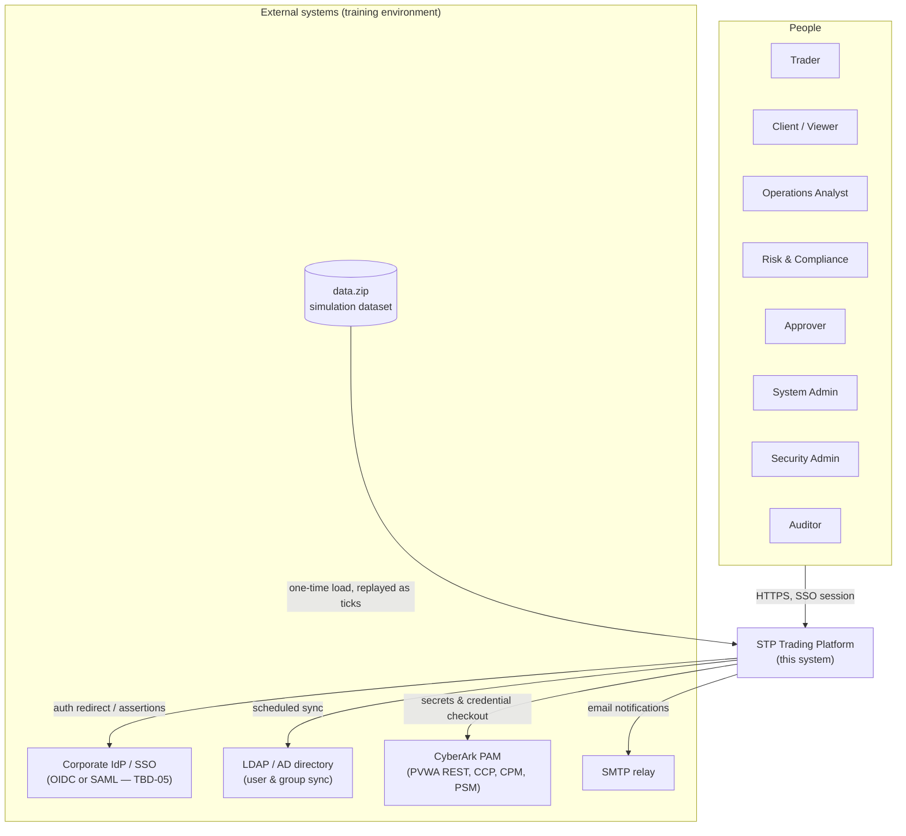
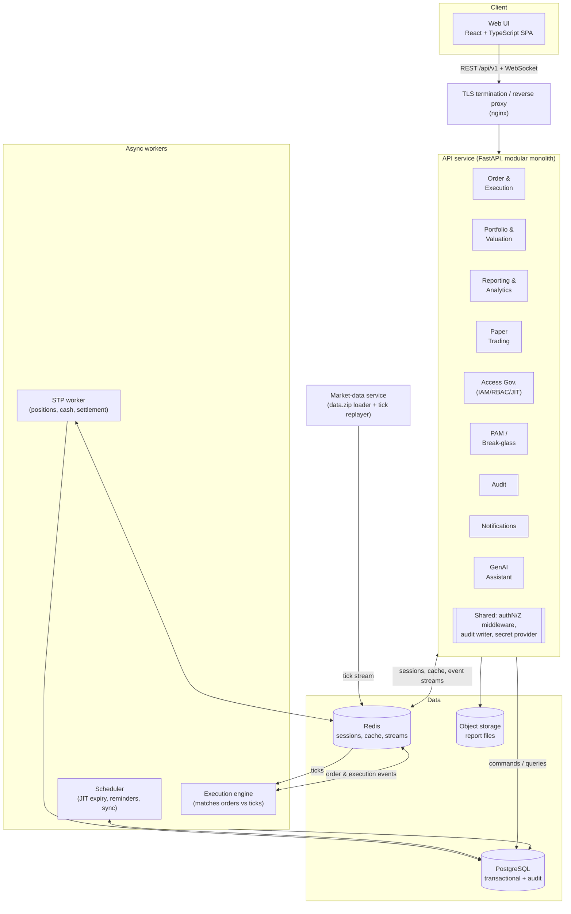

# Design Document — Next-Generation Trading Platform with Straight-Through Processing (STP)

| | |
|---|---|
| **Document ID** | DSN-STP-2026-001 |
| **Version** | 1.0 — Draft for review |
| **Date** | 26 July 2026 |
| **Source basis** | SRS-STP-2026-001 v1.0; Project Brief — Nomura Tech Graduate Program 2026 |
| **Status** | Proposal. Items marked **[P]** resolve SRS `[TBD]` points and need week-1 confirmation (SRS section 9). |

> **Document map:** This file is the architecture overview and index. Module-level designs (former §§5–12) live under [`docs/design/`](docs/design/README.md) — see that index for the full document set; §5 below links each module to its document.

---

## 1. Purpose and Scope

This document translates SRS-STP-2026-001 into a buildable technical design for the 3-week MVP. It defines the architecture and cross-cutting decisions, plus traceability back to SRS requirement IDs so every design element can be checked against a requirement; module-level component design, data design, security, DevOps/deployment and testing detail live in the per-module documents under [`docs/design/`](docs/design/README.md) (see the document map above).

Design goals, in priority order:

1. **Demonstrable end-to-end STP** in week 3 — order ticket to simulated settlement with zero manual steps (FR-ORD-005, NFR-CMP-004).
2. **DevSecOps from day one** (C-05): authN/Z, audit, secrets management are architectural foundations, not add-ons.
3. **Simplicity under a 3-week timebox** (C-06): the fewest moving parts that still satisfy the MUST requirements; MoSCoW Should/Could items get extension points, not half-built features.
4. **Cloud portability** (C-03): no hard dependency on AWS- or Azure-only services.

---

## 2. Architecture Drivers

Constraints and NFRs from the SRS that shape the architecture:

| Driver | Consequence |
|---|---|
| C-01 Python; SRS proposes FastAPI | All backend services in Python 3.11+ / FastAPI |
| C-04 simulation data only | Market-data replay service replaces any live feed; everything else consumes its tick stream |
| C-07 REST/JSON under `/api/v1` | Single API façade, versioned routes |
| C-09 secrets from CyberArk at runtime | A bootstrap "secret provider" component is a startup dependency of every service |
| NFR-SEC-002 deny-by-default, server-side | Authorization middleware on every route; effective-permission resolver is a shared library |
| NFR-SEC-008 tamper-evident audit | Append-only `AuditEvent` table with hash chaining (`prev_hash`) |
| NFR-SCL-001 stateless services | No in-process session state; sessions and caches externalized to Redis |
| FR-ORD-005 STP without manual intervention | Execution events drive position/settlement updates via an internal event pipeline |
| NFR-PER-004 refresh within 5 s of a tick | Push channel (WebSocket) from valuation projector to UI |
| FR-PTR-002 paper = same path as real | One order pipeline; paper accounts are a portfolio type (`PAPER`), not a separate engine |

---

## 3. System Context

Key context points:

- The platform is self-contained; live-market connectivity and real-money trading are out of scope (SRS 1.2).
- `data.zip` is loaded once and replayed internally as a tick stream (INT-04); nothing else in the system knows the data is simulated.
- All human access is via SSO; there are no local passwords (NFR-SEC-001).

---

## 4. Architecture Overview

### 4.1 Style: modular monolith API + event-driven workers

**Decision D-01 [P]:** One deployable **API service** (modular monolith) plus three small out-of-process workers and a static frontend — rather than a microservice-per-module split.

Rationale: 14 SRS modules in 3 weeks cannot carry the operational cost of a dozen services (pipelines, service discovery, distributed tracing). A monolith with strict module boundaries gives one deployable to secure, observe and demo, while the event pipeline and workers keep the STP flow asynchronous and the services stateless (NFR-SCL-001). Module boundaries are drawn so that a future split is mechanical (each module owns its tables and exposes an internal interface only).

### 4.2 Internal event pipeline

**Decision D-02 [P]:** Domain events travel over **Redis Streams**, written via a **transactional outbox**: a module commits its state change and an outbox row in one PostgreSQL transaction; a relay publishes outbox rows to the stream. Consumers are idempotent (they record processed event IDs).

Why: STP (FR-ORD-005) requires that an execution *always* triggers position/cash/settlement updates with no manual step; the outbox guarantees the event survives a crash between DB commit and publish, without adding a heavier broker. Redis is already needed for sessions and caching, so no new infrastructure.

Primary streams and consumers:

| Stream | Producer | Consumers |
|---|---|---|
| `market.ticks` | Market-data replayer | Execution engine, valuation projector, alert evaluator, UI push |
| `orders.accepted` | Order module | Execution engine |
| `trading.executions` | Execution engine | STP worker, valuation projector, notifications, audit |
| `stp.lifecycle` | STP worker | Notifications, audit, UI push |
| `access.events` (requests, grants, checkout, break-glass) | IAM/PAM modules | Notifications, audit, scheduler |
| `audit.all` | every module (via audit writer) | Audit persistence consumer |

The audit path is deliberately **synchronous for security-critical actions** (checkout, break-glass, authorization denials): the API call writes its audit record in the same request and fails closed if the write fails (FR-AUD-001 E1, FR-CPAM-003 E1). Lower-value events flow via `audit.all` asynchronously.

### 4.3 Technology selection

**Decision D-03 [P]** — concrete picks for SRS `[TBD]`s, all replaceable behind module boundaries:

| Area | Choice | Notes |
|---|---|---|
| Language / framework | Python 3.11+, FastAPI, Pydantic v2 | SRS 2.4 proposal; async I/O suits tick-driven load |
| Frontend | React 18 + TypeScript, Vite; charts: Apache ECharts | Candlesticks + indicator overlays (FR-RPT-002, FR-ANA-002) |
| Database | PostgreSQL 15 (TBD-10 recommendation) | Single instance; partitioning for `PriceTick` / `AuditEvent` |
| Cache / sessions / streams | Redis 7 | One instance, three logical uses (DB indices separated) |
| WebSocket | FastAPI/Starlette WS on the API service | Dashboard push within 5 s (NFR-PER-004) |
| OIDC client | `authlib` | SSO integration (TBD-05: OIDC preferred, SAML fallback via IdP config) |
| PDF reports | WeasyPrint (HTML→PDF); CSV via stdlib | FR-RPT-003 |
| GenAI | LLM behind a provider-agnostic client (OpenAI-compatible API); tool-calling | Advisory-only, strict tool whitelist (see [07 — GenAI Assistant](docs/design/07-genai-assistant.md)) |
| IaC / CI | Terraform, GitLab CI/CD, Docker | C-02 |
| Object storage | S3-compatible (AWS S3 or Azure Blob via adapter) | Report files (SRS 6.3) |

**Decision D-04 [P]:** SSO via **OIDC** as the primary protocol; the IdP abstraction is a thin interface so SAML can slot in if the training IdP requires it (TBD-05).

**Decision D-05 [P]:** Sessions are **opaque server-side tokens stored in Redis** (idle 30 min / absolute 12 h, NFR-SEC-006) rather than long-lived JWTs, because FR-IAM-005 and FR-JIT-002 require revocation to take effect within ~60 s — server-side sessions make invalidation trivial.

**Decision D-10:** Market data uses a **single store** (`PriceTick`, dailies and minute bars together) plus a **simulation clock** (`registry.get_sim_now()`): chart ranges, stale-price flags and news visibility are measured against it, never `utcnow()`; while a replay runs, data beyond the sim clock is withheld.

**Decision D-11:** The replay **loops the dataset**: minute bars are replayed in dataset-time order at `REPLAY_BARS_PER_SECOND` (default 1.0 ≈ 6.5 min per market day, emitted on wall-second boundaries); `REPLAY_MODE=loop|hold` (default `loop`).

**Decision D-12:** Instruments come from the **dataset loader** (7 US equities + 4 generated-price bonds; USD; equities lot 1/tick 0.01, bonds lot 1000/tick 0.01 quoted % of par); the seed keeps users/roles/portfolios (USD cash 1M/500k); a missing data dir falls back to a generated random-walk feed with the same symbols.

**Decision D-13:** The historical/live overlap (Jun 30 – Jul 10) is resolved by loading dailies only before Jun 30; wide chart timeframes get server-side daily aggregation (API shapes unchanged).

**Decision D-14:** News is **reference data** (`news_items` + `news_sentiments`): loaded once by the dataset loader, never replayed, sim-clock capped.

**Decision D-15:** News consumers: the assistant's news/sentiment intent; the analytics endpoints `GET /instruments/{symbol}/news`, `GET /news/latest`, `GET /instruments/{symbol}/sentiment`; the frontend Charts News tab + sentiment panel and the Dashboard market-news widget.

**Decision D-16:** USD display formatting (resolves **TBD-16**: USD; **TBD-17**: the dataset's US-equities universe).

---

## 5. Detailed module designs

Module-level design has been split into self-contained documents under [`docs/design/`](docs/design/README.md) — see that index for the full set. (Former §§5–12 of this document moved there; former §§13–15 are now §§6–8 below.) The architecture overview above (§§3–4) remains the single source for system context, the module map, the event pipeline, technology selection and decisions D-01…D-06 and D-10…D-16.

### Trading & market data

- [01 — Market-data service](docs/design/01-market-data.md) — `data.zip` load, tick replay, latest-price cache, staleness guard (former §5.1)
- [02 — Order execution & STP](docs/design/02-order-execution-stp.md) — order ticket, validation, matching, settlement; order state machine; order→STP flow (former §5.2, §7.1)
- [03 — Portfolio management & valuation](docs/design/03-portfolio-management.md) — valuation projector, KPIs, read APIs, WebSocket push (former §5.3, §9)
- [04 — Reporting & charting](docs/design/04-reporting-charting.md) — dashboard aggregation, OHLC series, PDF/CSV reports (former §5.4)
- [05 — Technical analytics](docs/design/05-technical-analytics.md) — indicator service, chart overlays (former §5.4)
- [06 — Paper trading](docs/design/06-paper-trading.md) — shared pipeline, `PAPER` portfolio type and marking (former §5.2 FR-PTR parts)
- [07 — GenAI assistant](docs/design/07-genai-assistant.md) — advisory-only assistant, read-only tool whitelist (former §5.8; stretch)

### Access governance & privileged access

- [08 — Access request workflow](docs/design/08-access-request-workflow.md) — provisioning sync, request → approval → grant lifecycle (former §5.5 IAM parts, §7.2)
- [09 — RBAC & authorization](docs/design/09-rbac-authorization.md) — effective-permission resolver, authN/Z middleware, SoD, route permission declarations (former §5.5, §6, §9)
- [10 — JIT access](docs/design/10-jit-access.md) — time-bound grants, expiry sweep, request-time window checks (former §5.5 JIT parts)
- [11 — Privileged access (CyberArk)](docs/design/11-privileged-access-cyberark.md) — PVWA checkout/check-in, CPM rotation, fail-closed (former §5.5 CPAM, §7.3)
- [12 — Break-glass](docs/design/12-break-glass.md) — emergency access activation and review SLA (former §5.5 BG, §7.4)

### Platform services

- [13 — Audit logging](docs/design/13-audit-logging.md) — append-only hash-chained audit, search/export (former §5.6, §8.2 hash-chain parts)
- [14 — Notifications](docs/design/14-notifications.md) — event-driven in-app + email, reminders, preferences (former §5.7)
- [15 — Admin & governance](docs/design/15-admin-governance.md) — governance dashboard, health probes, export (former §5.9)
- [22 — Real-time WebSocket push](docs/design/22-websocket-push.md) — authenticated `WS /api/v1/ws`: tick broadcast + per-user notification/execution hints (NFR-PER-004; implements former §9 `/ws`)

### Cross-cutting

- [16 — Data design](docs/design/16-data-design.md) — ER model and physical design notes (former §8)
- [17 — Security design](docs/design/17-security-design.md) — NFR-SEC measures; authN/Z middleware, audit writer, secret provider, error model (former §10, §6)
- [18 — DevOps & deployment](docs/design/18-devops-deployment.md) — D-06 deployment, Terraform, CI/CD (former §11)
- [19 — Testing strategy](docs/design/19-testing-strategy.md) — test levels mapped to ACs/NFRs (former §12)

API design conventions (former §9) are unchanged and applied per module: SRS 5.2 verbatim — base `/api/v1`, JSON, `Idempotency-Key` on mutating POSTs, cursor pagination, standard error envelope with `traceId` — plus OpenAPI-first fragments, route-level permission declarations (see [09](docs/design/09-rbac-authorization.md)) and the authenticated WebSocket `/ws` (see [03](docs/design/03-portfolio-management.md), [14](docs/design/14-notifications.md)).

---

## 6. Requirements → Design Traceability

| SRS module | Design document(s) |
|---|---|
| FR-ORD Order Execution & STP | [02 — Order Execution & STP](docs/design/02-order-execution-stp.md); §4.2 (event pipeline) |
| FR-PFM Portfolio Management | [03 — Portfolio Management](docs/design/03-portfolio-management.md) |
| FR-RPT Reporting & Charting | [04 — Reporting & Charting](docs/design/04-reporting-charting.md) |
| FR-ANA Technical Analytics | [05 — Technical Analytics](docs/design/05-technical-analytics.md) |
| FR-PTR Paper Trading | [06 — Paper Trading](docs/design/06-paper-trading.md); [16 — Data Design](docs/design/16-data-design.md) (`Portfolio.type`) |
| FR-AI GenAI Assistant | [07 — GenAI Assistant](docs/design/07-genai-assistant.md); [17 — Security Design](docs/design/17-security-design.md) |
| FR-IAM Access Request & Approval | [08 — Access Request Workflow](docs/design/08-access-request-workflow.md) |
| FR-RBAC | [09 — RBAC & Authorization](docs/design/09-rbac-authorization.md); [17 — Security Design](docs/design/17-security-design.md) |
| FR-JIT | [10 — JIT Access](docs/design/10-jit-access.md); [08 — Access Request Workflow](docs/design/08-access-request-workflow.md) |
| FR-CPAM CyberArk checkout | [11 — Privileged Access (CyberArk)](docs/design/11-privileged-access-cyberark.md); [17 — Security Design](docs/design/17-security-design.md) |
| FR-BG Break-glass | [12 — Break-Glass](docs/design/12-break-glass.md) |
| FR-AUD Audit | [13 — Audit Logging](docs/design/13-audit-logging.md); [17 — Security Design](docs/design/17-security-design.md); [16 — Data Design](docs/design/16-data-design.md) |
| FR-NTF Notifications | [14 — Notifications](docs/design/14-notifications.md) |
| FR-ADM Admin & Governance | [15 — Admin & Governance](docs/design/15-admin-governance.md); [18 — DevOps & Deployment](docs/design/18-devops-deployment.md) (health probes) |
| NFRs | [17 — Security Design](docs/design/17-security-design.md) (security), [18 — DevOps & Deployment](docs/design/18-devops-deployment.md) (DevOps/availability), [19 — Testing Strategy](docs/design/19-testing-strategy.md) (performance tests), [16 — Data Design](docs/design/16-data-design.md) (retention/volumes) |

---

## 7. Open Items Carried from the SRS

Design proposals awaiting week-1 confirmation (SRS §9); defaults adopted in the module designs in brackets:

- **TBD-01/02/03** approval chains, JIT duration caps, break-glass policy — defaults: manager→owner (+security for privileged); 8 h privileged / 90 d standard; 4 h break-glass, 24 h review SLA.
- **TBD-04/05** CyberArk and IdP specifics — D-04 assumes OIDC; cert-based PVWA app auth.
- **TBD-06** dataset schema — **RESOLVED**: three packs under `data/` (daily OHLC 2026-01-02→2026-07-10; 1-minute bars 2026-06-30→2026-08-29; news with per-ticker sentiment, Jul–Aug) — loaded by the dataset loader (see [01 — Market-Data Service](docs/design/01-market-data.md); D-10…D-14).
- **TBD-07** performance targets — NFR proposals adopted as test thresholds.
- **TBD-11** cloud provider — Terraform written provider-portable until confirmed.
- **TBD-13** report scheduling — **RESOLVED** ([design 23](docs/design/23-scheduled-reports.md)): daily/weekly per portfolio+type+format, sim-clock driven, ≤10 active per user.
- **TBD-16** currency — **RESOLVED**: USD (D-16).
- **TBD-17** instrument scope — **RESOLVED**: dataset's 7 US equities **plus 4 bonds** (generated prices; product-owner interview, docs/design/21) — equities-only rejected by the business.
- **TBD-18** order types — **RESOLVED**: MARKET, LIMIT, STOP, STOP_LIMIT (product-owner interview, docs/design/21) + time-in-force (DAY/GTC/IOC) and trailing stop (design 24); iceberg stays roadmap.

---

## 8. Delivery Plan (3 weeks, MoSCoW-aligned)

| Week | Goal | Contents |
|---|---|---|
| 1 | Walking skeleton + governance spine | Repo, CI/CD, Terraform dev env; SSO login; RBAC resolver + seeded roles; audit writer; access request→approval→grant→expiry; data.zip inspection & loader |
| 2 | Trading core | Order ticket + validation; execution engine + replayer; STP worker (positions/cash/settlement); portfolio APIs + dashboard; charts; notifications; CyberArk checkout; break-glass |
| 3 | Breadth + hardening + demo | Paper trading; reports (PDF/CSV); indicators + overlays; admin/governance dashboards; performance & security test pass; GenAI assistant if on schedule; demo rehearsal |

Stretch (Could) items — GenAI module, price alerts, scheduled reports, recertification export — are attempted only after all Must/Should items pass their acceptance criteria.

---

*End of design document. Feedback to the technology-analyst team; changes via merge request.*
