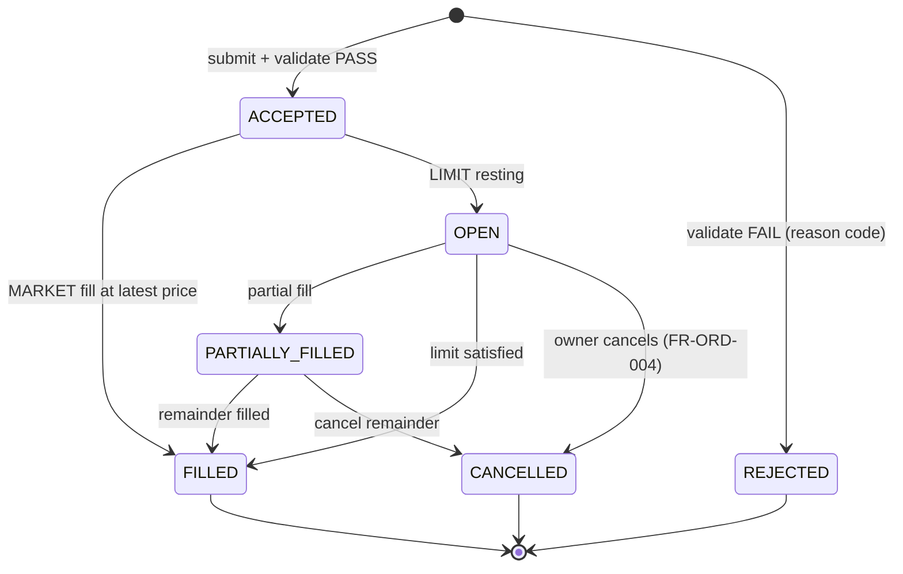
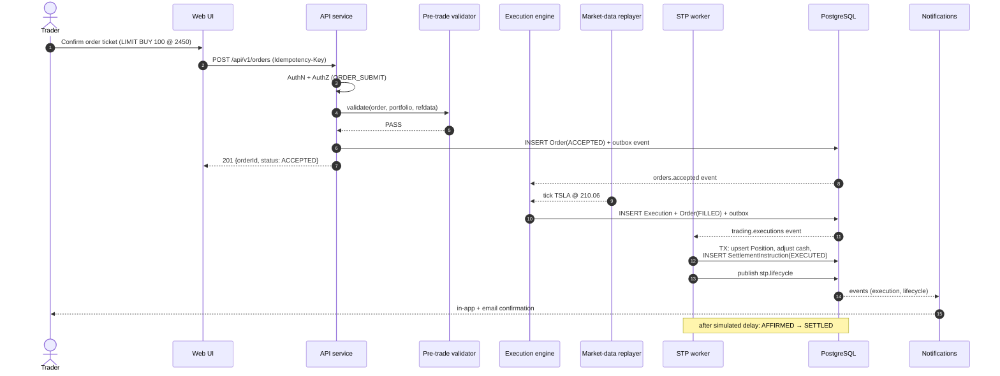

# 02 — Order Execution & STP

> Part of the STP platform design set — overview: [DESIGN.md](../../DESIGN.md) · index: [README.md](README.md)
> Source: former DESIGN.md §5.2 (trading parts) and §7.1, incl. the order state machine. Decisions, IDs and requirement text unchanged.

## Purpose

Deliver demonstrable end-to-end straight-through processing: order ticket to simulated settlement with zero manual steps (FR-ORD-005, NFR-CMP-004) — design goal #1 (DESIGN.md §1). One order pipeline serves both real and paper portfolios; paper specifics live in [06 — Paper Trading](06-paper-trading.md).

## SRS requirements covered

- **FR-ORD-001 … FR-ORD-005** — order capture, validation, execution, cancellation, STP settlement.
- **FR-ORD-001 E2** — duplicate `Idempotency-Key` returns the original order.
- **FR-ORD-003 E1** — stale feed suspends order submission (see [01 — Market-Data Service](01-market-data.md)).
- **FR-ORD-004** — owner cancellation (state machine below).
- **FR-ORD-005 E1** — STP failure handling: `STP_EXCEPTION`, Ops alert, retry with backoff.
- **NFR-PER-001** — pre-trade validation p95 ≤ 500 ms.
- **NFR-PER-001…005** — adopted as test thresholds, incl. 2 s market-order E2E (see 19).
- **NFR-CMP-004** — STP as the demonstrable core flow.
- **A1** — partial fills supported by configuration; MVP default is full fills.

## Components

- **Order ticket API** — `POST /orders` with `Idempotency-Key` header; on duplicate key returns the original order (FR-ORD-001 E2). Key stored unique on `Order.idempotency_key`.
- **Pre-trade validator** — rule chain: instrument tradable → lot-size/quantity bounds → limit-price sanity → buying power (BUY) or holdings (SELL) → instrument-level permission. Emits machine-readable reason codes on failure (422 `BUSINESS_RULE_VIOLATION`). Target p95 ≤ 500 ms (NFR-PER-001): rules run in-process over Redis-cached reference data and the portfolio snapshot; no external calls.
- **Execution engine** (worker) — consumes `orders.accepted`, matches against the tick stream: MARKET fills immediately at latest price; LIMIT rests as OPEN and is re-evaluated on each tick. Writes `Execution` rows and publishes `trading.executions`. Partial fills supported by configuration (A1); default MVP behavior is full fills to keep the demo path deterministic.
- **STP worker** — consumes `trading.executions` and in **one DB transaction**: upserts `Position` (quantity, avg_cost), adjusts `Portfolio.cash_balance`, inserts `SettlementInstruction` (`EXECUTED`), publishes `stp.lifecycle`. A settlement timer then advances `AFFIRMED → SETTLED` after the simulated delay [P: 5 s demo default]. Failure marks the trade `STP_EXCEPTION`, alerts Ops via health view and notification (FR-ORD-005 E1), and retries with backoff.
- **Paper trading (FR-PTR)** reuses this entire path unchanged — see [06 — Paper Trading](06-paper-trading.md).

## Flows

Order state machine:

Order → execution → STP settlement (AC-001, AC-002):

## Data entities used

- `Order` (immutable except defined status fields; unique `idempotency_key`), `Execution`, `SettlementInstruction` (lifecycle `EXECUTED|AFFIRMED|SETTLED`), `Position`, `Portfolio` (`cash_balance`), `Instrument` (tradable, lot/tick sizes).
- Transactional outbox rows → streams `orders.accepted`, `trading.executions`, `stp.lifecycle` (DESIGN.md §4.2).
- Redis: `px:latest:{symbol}` (latest price), cached reference data and portfolio snapshot for validation.

## API endpoints used

- `POST /api/v1/orders` — header `Idempotency-Key`; route-level permission `ORDER_SUBMIT` (route declarations map 1:1 to the SRS endpoint table, see [09 — RBAC & Authorization](09-rbac-authorization.md)). Success: `201 {orderId, status: ACCEPTED}`.
- Standard conventions (former DESIGN.md §9): base `/api/v1`, JSON, `Idempotency-Key` on mutating POSTs, standard error envelope with `traceId`.
- Cancellation (FR-ORD-004) and order queries follow the same conventions via the module's OpenAPI fragment.

## Error / edge cases

- **Duplicate submission** — same `Idempotency-Key` returns the original order, no duplicate insert (FR-ORD-001 E2).
- **Validation failure** — 422 `BUSINESS_RULE_VIOLATION` with machine-readable reason codes; order → `REJECTED`.
- **Requeue (added 2026-08-04)** — `REJECTED` is not terminal for Operations: `POST /orders/{id}/requeue` (`STP_EXCEPTION_HANDLE`) lets ops amend (qty/limit/stop/trail) and re-submit through the same validation; valid → `ACCEPTED` + `orders.accepted` outbox (engine fills it) + `ORDER_REQUEUED` audit + owner notified; still invalid → stays `REJECTED` with the updated reason (422). Order list/detail read access widened to `ORDER_VIEW` **or** `STP_EXCEPTION_HANDLE` (`require_any_permission` in core/security.py) so ops can see the failure queue at all.

- **Stale feed** — 503 for the affected instrument (FR-ORD-003 E1; staleness guard in 01).
- **STP failure** — trade marked `STP_EXCEPTION`; Ops alerted via health view and notification; retry with backoff (FR-ORD-005 E1; visibility in [15 — Admin & Governance](15-admin-governance.md)).
- **Partial fills** — supported by configuration (A1); MVP default full fills for a deterministic demo path.
- **Cancellation** — owner cancels OPEN orders; remainder cancel for PARTIALLY_FILLED (FR-ORD-004, state machine).

## Acceptance criteria mapping

- **AC-001, AC-002** — the order→execution→STP settlement flow above is the acceptance path (flow title in the source design).
- Integration tests: order→STP with replayed ticks covers AC-001…AC-015 as applicable (see 19, Integration row).
- Performance tests: 500 ms validation, 2 s market-order E2E (NFR-PER-001…005; see 19, Performance row).
