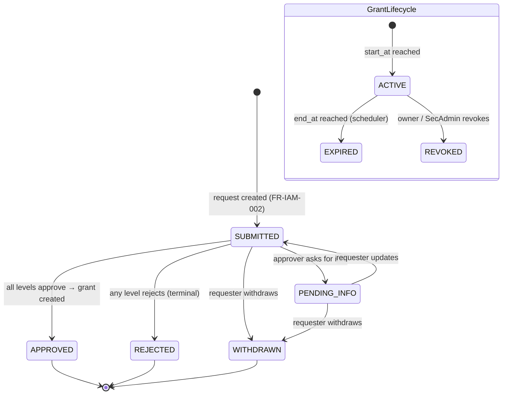
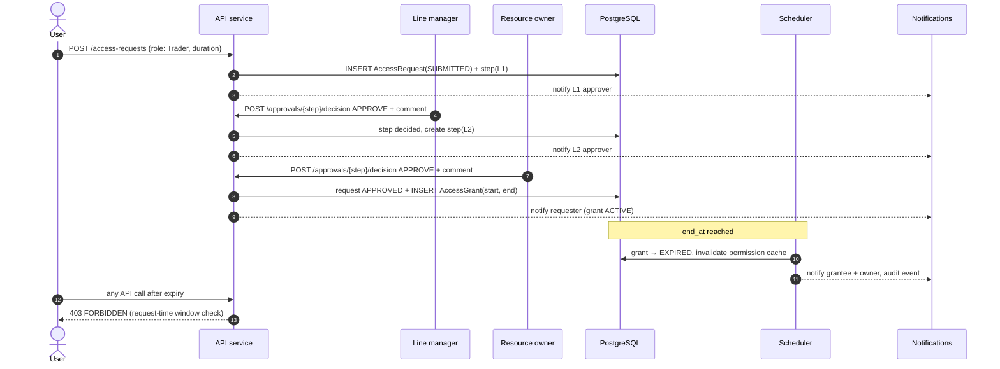

# 08 — Access Request Workflow (IAM)

> Part of the STP platform design set — overview: [DESIGN.md](../../DESIGN.md) · index: [README.md](README.md)
> Source: former DESIGN.md §5.5 (IAM parts: provisioning, access-request workflow) and §7.2, incl. the access request lifecycle diagram. Decisions, IDs and requirement text unchanged.

## Purpose

Provision users from the corporate directory, authenticate them via SSO, and govern role assignment through a multi-level access-request → approval → time-bound grant workflow. Grant expiry/revocation mechanics are in [10 — JIT Access](10-jit-access.md); permission enforcement in [09 — RBAC & Authorization](09-rbac-authorization.md).

## SRS requirements covered

- **FR-IAM-001** — directory sync + SSO login matches or creates the profile.
- **FR-IAM-002** — access request submission and approval workflow.
- **FR-IAM-005** — revocation SLA (enforced via permission-cache invalidation; see 09).
- **NFR-SEC-001** — all human access via SSO; no local passwords.
- **TBD-01 / TBD-02** — approval chains and duration caps [P defaults: line manager → resource owner, + security officer for privileged roles; 8 h privileged / 90 d standard].
- **TBD-05** — IdP specifics; D-04 assumes OIDC (login fails closed on IdP outage [P]).

## Components

- **Provisioning** — scheduler-driven LDAP/AD delta sync into `User` (UPN, displayName, mail, manager, memberOf); SSO login matches or creates the profile (FR-IAM-001). Authorization uses last-synced data if the directory is down; login fails closed on IdP outage [P, TBD-05].
- **Access-request workflow** — `AccessRequest` + ordered `ApprovalStep`s; chain resolved from a per-role config table [P default: line manager → resource owner, + security officer for privileged roles; TBD-01]. Rejection is terminal; approval of the final step creates the `AccessGrant` transactionally.

## Flows

Access request lifecycle:

Access request → approval → time-bound grant (AC-010, AC-011):

## Data entities used

- `User` (UPN, displayName, mail, manager, status, synced_at), `Role`, `AccessRequest` (justification, requested duration, status), `ApprovalStep` (level, approver, decision, comment), `AccessGrant` (start_at, end_at, status).
- Events on `access.events` (requests, grants) consumed by notifications, audit, scheduler (DESIGN.md §4.2).

## API endpoints used

- `POST /access-requests` — body `{role, duration}`; creates `AccessRequest(SUBMITTED)` + first approval step.
- `POST /approvals/{step}/decision` — approver decision (APPROVE/REJECT) + comment; final approval creates the `AccessGrant` transactionally.
- SSO login via OIDC authorization-code flow (authlib; D-04, TBD-05).
- Standard conventions (former DESIGN.md §9): base `/api/v1`, `Idempotency-Key` on mutating POSTs, error envelope with `traceId`.

## Error / edge cases

- **Directory down** — authorization uses last-synced data (FR-IAM-001 note).
- **IdP outage** — login fails closed [P, TBD-05].
- **Rejection** — terminal at any level; **withdrawal** — by the requester from SUBMITTED or PENDING_INFO (lifecycle diagram).
- **Approver stalls** — stale approval tasks (>24 h) get reminders (see [14 — Notifications](14-notifications.md)).
- **Post-expiry calls** — 403 FORBIDDEN via request-time window check (see [10 — JIT Access](10-jit-access.md)).

## Acceptance criteria mapping

- **AC-010, AC-011** — the request → approval → time-bound grant flow above is the acceptance path (flow title in the source design).
- Integration tests: approval chains and JIT expiry (see [19 — Testing Strategy](19-testing-strategy.md), Integration row).
