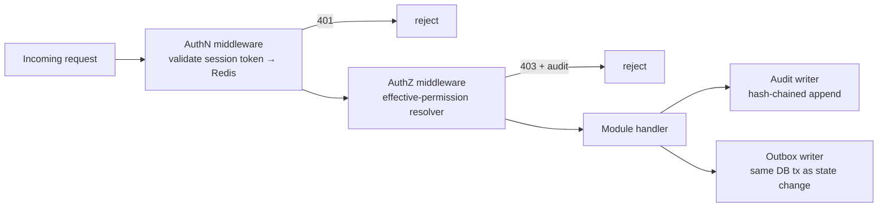

# 09 — RBAC & Authorization

> Part of the STP platform design set — overview: [DESIGN.md](../../DESIGN.md) · index: [README.md](README.md)
> Source: former DESIGN.md §5.5 (effective-permission resolver, SoD check), §6 (authN/Z middleware), §9 (route-level permission declarations). Decisions, IDs and requirement text unchanged.

## Purpose

Enforce deny-by-default, server-side authorization (NFR-SEC-002) on every route: an effective-permission resolver computes what a user may do from their active, in-window grants, and route-level permission declarations map 1:1 to the SRS endpoint table. Authentication is via opaque server-side sessions (D-05).

## SRS requirements covered

- **NFR-SEC-002** — deny-by-default, server-side authorization.
- **FR-RBAC-002 E1** — fail closed when permission data is unavailable.
- **FR-RBAC-004** — segregation-of-duties check at assignment.
- **FR-IAM-005** — revocation effective within ~60 s (permission-cache invalidation).
- **FR-JIT-002** — grant window validated at request time (safety net).
- **NFR-SEC-006 / D-05** — sessions: opaque server-side tokens in Redis, idle 30 min / absolute 12 h.
- **AC-018** — every route carries a permission declaration (automated test).

## Components

- **AuthN middleware** — resolves the opaque session token from Redis (idle sliding 30 min, absolute 12 h).
- **AuthZ middleware** — decorator per route declaring the required permission; resolves via the effective-permission resolver. Fail closed when permission data is unavailable (FR-RBAC-002 E1).
- **Effective-permission resolver** — shared library used by the authorization middleware: union of permissions from the user's **active, in-window grants**; deny-by-default; result cached in Redis ≤ 60 s with explicit invalidation on grant change (supports FR-IAM-005's revocation SLA). Every check also validates the grant window at request time (FR-JIT-002 safety net).
- **SoD check** — conflict matrix table consulted at assignment; `NONE / FLAGGED / BLOCKED`; FLAGGED requires security-officer acknowledgement before activation (FR-RBAC-004).
- **Route-level permission declarations** — map 1:1 to the SRS endpoint table (e.g., `POST /orders` → `ORDER_SUBMIT`); the authZ middleware enforces them, and an automated test enumerates all routes asserting none lack a permission declaration (supports AC-018). Each module ships an OpenAPI fragment merged into one spec; contract tests validate responses against it in CI (OpenAPI-first, former DESIGN.md §9).

## Flows

Request pipeline (cross-cutting, also shown in [17 — Security Design](17-security-design.md)):

The grant lifecycle that feeds the resolver (`ACTIVE` → `EXPIRED`/`REVOKED`) is in [08 — Access Request Workflow](08-access-request-workflow.md); expiry/revocation mechanics in [10 — JIT Access](10-jit-access.md).

## Data entities used

- `Role`, `Permission`, `RolePermission`, `AccessGrant` (active, in-window only), `User`.
- Redis: `sess:*` (sessions), `perm:{user}` (permission cache, ≤ 60 s, explicit invalidation on grant change).
- SoD conflict matrix table (per FR-RBAC-004).

## API endpoints used

- Applies to **every** route under `/api/v1`: unauthenticated → 401; authenticated but unauthorized → 403 + audit (authorization denials are audited synchronously, DESIGN.md §4.2).
- Example mapping: `POST /orders` → `ORDER_SUBMIT` (see [02 — Order Execution & STP](02-order-execution-stp.md)).
- Standard error envelope with `traceId` on every response (see [17 — Security Design](17-security-design.md)).

## Error / edge cases

- **Resolver error / permission data unavailable** — default-deny, fail closed (NFR-SEC-002, FR-RBAC-002 E1).
- **Revocation latency** — cache ≤ 60 s with explicit invalidation on grant change supports FR-IAM-005's ~60 s SLA; the request-time window check bounds JIT access loss to the check itself (AC-011, see 10).
- **SoD conflict** — `BLOCKED` prevents assignment; `FLAGGED` requires security-officer acknowledgement before activation (FR-RBAC-004).
- **Denials** — 403 responses are audited synchronously as security-critical events (see [13 — Audit Logging](13-audit-logging.md)).

## Acceptance criteria mapping

- **AC-018** — automated test enumerates all routes asserting none lack a permission declaration (contract-test level, see [19 — Testing Strategy](19-testing-strategy.md)).
- **Deny-by-default sweep** — security test level (see 19, Security row).
- **AC-011** — request-time window checks (with 10); revocation SLA supports FR-IAM-005.
