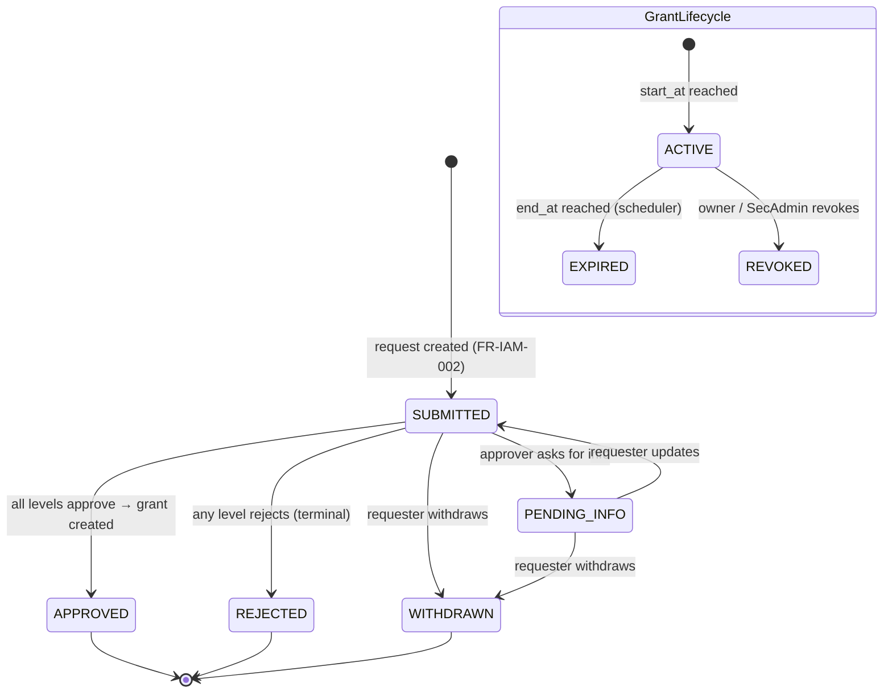

# 10 — Just-in-Time (JIT) Access

> Part of the STP platform design set — overview: [DESIGN.md](../../DESIGN.md) · index: [README.md](README.md)
> Source: former DESIGN.md §5.5 (JIT expiry parts). Decisions, IDs and requirement text unchanged.

## Purpose

Ensure access is time-bound: grants carry `start_at`/`end_at`, expire automatically, and — regardless of scheduler timing — no request is ever authorized outside its grant window (FR-JIT-002). Request submission and approval live in [08 — Access Request Workflow](08-access-request-workflow.md); enforcement in [09 — RBAC & Authorization](09-rbac-authorization.md).

## SRS requirements covered

- **FR-JIT-002** — time-bound grants; window validated at request time.
- **FR-IAM-005** — revocation/expiry effective within ~60 s (permission-cache invalidation).
- **AC-011** — request-time window validation bounds worst-case access loss to the check itself.
- **TBD-02** — JIT duration caps [P defaults: 8 h privileged / 90 d standard].
- **TBD-09** — expiry reminder timings [P: 30 min privileged / 24 h standard], delivered by [14 — Notifications](14-notifications.md).

## Components

- **JIT expiry** — scheduler sweeps due grants every 30 s → `EXPIRED`, permission-cache invalidation, notification + audit. Request-time window validation bounds worst-case access loss to the check itself (AC-011).
- **Request-time window validation** — every authorization check validates the grant window at request time (FR-JIT-002 safety net; resolver in [09](09-rbac-authorization.md)).
- **Revocation** — owner / SecAdmin revokes an ACTIVE grant (grant lifecycle below); the permission cache is invalidated on grant change (supports FR-IAM-005's revocation SLA).

## Flows

Grant lifecycle (nested state of the access request lifecycle, shared with [08](08-access-request-workflow.md)):

The expiry tail of the end-to-end sequence — `end_at` reached → grant `EXPIRED` + permission-cache invalidation → notify grantee + owner + audit → any API call after expiry returns 403 FORBIDDEN (request-time window check) — is shown in the sequence diagram in [08 — Access Request Workflow](08-access-request-workflow.md) (AC-010, AC-011).

## Data entities used

- `AccessGrant` (`start_at`, `end_at`, `status`, `revoked_by`) — the sole entity this module acts on.
- Redis `perm:{user}` — permission cache invalidated on grant change.
- Events on `access.events` (grants, expiry) consumed by notifications, audit, scheduler (DESIGN.md §4.2).

## API endpoints used

- **Any** API call after expiry → `403 FORBIDDEN` (request-time window check) — enforced by the authZ middleware/resolver (see 09).
- Revocation (owner / SecAdmin) per the grant lifecycle; concrete path per the module's OpenAPI fragment under the standard conventions (former DESIGN.md §9).

## Error / edge cases

- **Scheduler lag** — bounded by request-time window validation: even if the 30 s sweep is delayed, an expired grant cannot authorize a request (AC-011).
- **Revocation latency** — explicit permission-cache invalidation on grant change; cache TTL ≤ 60 s (FR-IAM-005).
- **Expiry reminders** — 30 min privileged / 24 h standard [P, TBD-09], scanned by the scheduler (see 14).

## Acceptance criteria mapping

- **AC-011** — primary criterion: request-time window validation bounds worst-case access loss to the check itself (also the tail of the flow in 08).
- **AC-010** — grant creation and expiry as part of the request → approval → grant flow (see 08).
- Integration tests: JIT expiry (see [19 — Testing Strategy](19-testing-strategy.md), Integration row).
