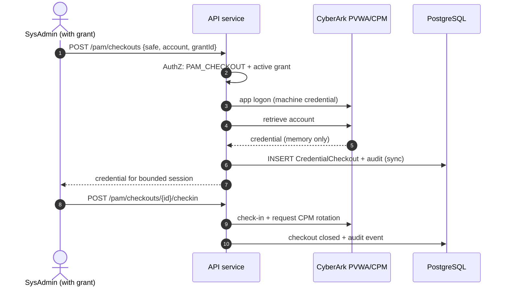

# 11 — Privileged Access (CyberArk CPAM)

> Part of the STP platform design set — overview: [DESIGN.md](../../DESIGN.md) · index: [README.md](README.md)
> Source: former DESIGN.md §5.5 (CyberArk adapter) and §7.3. Decisions, IDs and requirement text unchanged.

## Purpose

Broker privileged credential checkout through CyberArk so that credentials are retrieved just-in-time against an active grant, live only in request-scoped memory, are never logged or persisted (FR-CPAM-001), and are rotated on check-in.

## SRS requirements covered

- **FR-CPAM-001** — credential retrieval via CyberArk; credentials never logged or persisted.
- **FR-CPAM-003 E1** — audit write is synchronous; the call fails closed if the audit write fails.
- **C-09 / NFR-SEC-005** — secrets come from CyberArk at runtime (platform side: secret provider, see [17 — Security Design](17-security-design.md)).
- **NFR-SEC-010** — step-up authentication: checkout requires fresh SSO re-authentication [P, TBD-12].
- **TBD-04** — cert-based PVWA application authentication [P].

## Components

- **CyberArk adapter** — PVWA REST: application logon (cert [P, TBD-04]), account retrieval (checkout), check-in, CPM rotation request. Credentials live only in request-scoped memory, never logged or persisted (FR-CPAM-001). Fail closed with 503 when CyberArk is unreachable. PSM session IDs linked into the audit record when available.
- **Secret provider** (platform counterpart) — fetches the platform's own DB/SMTP/API credentials from CyberArk CCP at startup and on demand; detailed in [17 — Security Design](17-security-design.md).
- **Authorization** — checkout requires the `PAM_CHECKOUT` permission plus an active grant (see [09 — RBAC & Authorization](09-rbac-authorization.md)); the grant bounds the checkout (`AccessGrant` → `CredentialCheckout`).

## Flows

Privileged credential checkout (AC-013, AC-014):

## Data entities used

- `CredentialCheckout` (safe_name, account_id, checked_out/in_at, source_ip, psm_session_id).
- `AccessGrant` — bounds checkout (an active grant is required).
- `AuditEvent` — written synchronously; `psm_session_id` linked when available.

## API endpoints used

- `POST /pam/checkouts` — body `{safe, account, grantId}`; permission `PAM_CHECKOUT` + active grant; returns the credential for a bounded session.
- `POST /pam/checkouts/{id}/checkin` — check-in + CPM rotation request; closes the checkout.
- External: CyberArk PVWA REST (application logon, account retrieval, check-in, CPM rotation).
- Standard conventions (former DESIGN.md §9): base `/api/v1`, `Idempotency-Key` on mutating POSTs, error envelope with `traceId`.

## Error / edge cases

- **CyberArk unreachable** — fail closed with 503 (also covered by fail-closed dependency tests, see 19).
- **Missing permission or grant** — denied by default (see 09); denials audited synchronously.
- **Audit write failure** — the request fails closed (FR-CPAM-003 E1; synchronous audit path, DESIGN.md §4.2).
- **Step-up authentication** — checkout requires fresh SSO re-authentication [P, TBD-12] (NFR-SEC-010).
- **Credential hygiene** — credentials live only in request-scoped memory, never logged or persisted (FR-CPAM-001).

## Acceptance criteria mapping

- **AC-013, AC-014** — the checkout flow above is the acceptance path (flow title in the source design).
- Integration tests: CyberArk sandbox checkout (see [19 — Testing Strategy](19-testing-strategy.md), Integration row).
- Security tests: fail-closed dependency tests (see 19, Security row).
