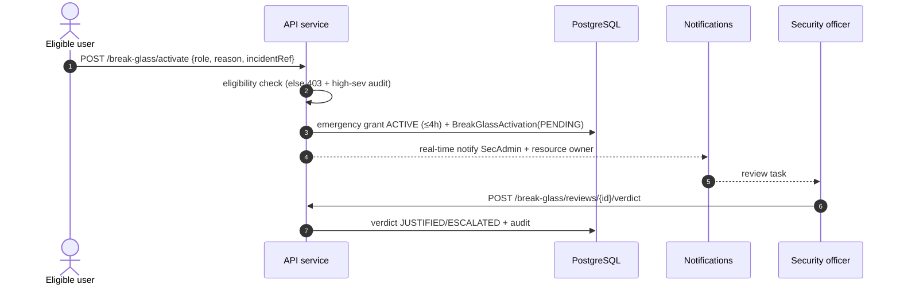

# 12 — Break-Glass (Emergency Access)

> Part of the STP platform design set — overview: [DESIGN.md](../../DESIGN.md) · index: [README.md](README.md)
> Source: former DESIGN.md §5.5 (break-glass) and §7.4. Decisions, IDs and requirement text unchanged.

## Purpose

Provide controlled emergency access: an eligible user can activate a short-lived emergency grant immediately, with high-severity audit, real-time notification, and a mandatory post-hoc review against an SLA (FR-BG-002).

## SRS requirements covered

- **FR-BG-002** — break-glass activation, notification, and review workflow.
- **TBD-03** — break-glass policy [P defaults: max 4 h grant, 24 h review SLA].
- **NFR-SEC-010** — step-up authentication: break-glass requires fresh SSO re-authentication [P, TBD-12].
- Synchronous high-severity audit per the audit design (see [13 — Audit Logging](13-audit-logging.md)).

## Components

- **Break-glass** — eligibility list table; activation creates an in-window emergency grant immediately (max 4 h [P, TBD-03]), emits high-severity audit + real-time notifications, and opens a `review_status = PENDING` item; reviews record verdicts with a 24 h SLA reminder/escalation (FR-BG-002).
- **Eligibility check** — non-eligible activation is rejected (403) and audited at high severity.
- **Window enforcement** — the emergency grant is an ordinary in-window `AccessGrant`: expiry and request-time checks apply as in [10 — JIT Access](10-jit-access.md).

## Flows

Break-glass (AC-015):

## Data entities used

- `BreakGlassActivation` (incident_ref, reason, expires_at, review_status, verdict).
- `AccessGrant` — the emergency grant (in-window, ≤ 4 h [P, TBD-03]).
- `AuditEvent` — high-severity, written synchronously; `Notification` — real-time to SecAdmin + resource owner.

## API endpoints used

- `POST /break-glass/activate` — body `{role, reason, incidentRef}`; eligibility checked first.
- `POST /break-glass/reviews/{id}/verdict` — records `JUSTIFIED`/`ESCALATED` + audit.
- Standard conventions (former DESIGN.md §9): base `/api/v1`, `Idempotency-Key` on mutating POSTs, error envelope with `traceId`.

## Error / edge cases

- **Ineligible user** — 403 + high-severity audit (fail closed; audited synchronously as a security-critical action, DESIGN.md §4.2).
- **Overdue review** — 24 h SLA reminder/escalation (FR-BG-002; reminders via [14 — Notifications](14-notifications.md)).
- **Window bound** — emergency grant ≤ 4 h [P, TBD-03]; expiry enforced as in [10 — JIT Access](10-jit-access.md).
- **Step-up authentication** — activation requires fresh SSO re-authentication [P, TBD-12] (NFR-SEC-010).

## Acceptance criteria mapping

- **AC-015** — the break-glass flow above is the acceptance path (flow title in the source design).
- Security tests: deny-by-default sweep covers the eligibility check (see [19 — Testing Strategy](19-testing-strategy.md), Security row).
