# 16 — Data Design

> Part of the STP platform design set — overview: [DESIGN.md](../../DESIGN.md) · index: [README.md](README.md)
> Source: former DESIGN.md §8 (entity-relationship model and physical design notes), incl. the ER diagram; news tables added for the dataset news pack (D-14). Decisions, IDs and requirement text unchanged.

## Purpose

Define the platform's persistent data model — directly from SRS section 6.1/6.2, with physical notes added — and the physical mechanisms (partitioning, immutability, single-writer positions, outbox, Redis namespaces) that keep it compliant and performant.

## SRS requirements covered

- **SRS 6.1/6.2** — entity model (source basis, verbatim).
- **SRS 6.3** — volumes: ~500 k ticks/day, ~50 k audit events/day.
- **NFR-PER-006** — audit search performance (indexing).
- **NFR-CMP-001** — trading records immutable after creation.
- **NFR-SEC-008** — audit table write restrictions (tamper evidence; see [13 — Audit Logging](13-audit-logging.md)).
- **C-10** — timestamps `timestamptz` UTC, rendered ISO 8601.
- **D-03** (design decision) — PostgreSQL 15; partitioning for `PriceTick` / `AuditEvent`.
- **D-14** (design decision) — news as reference data: `news_items` + `news_sentiments`, loaded once, never replayed, sim-clock capped.

## Components

Physical mechanisms (from the physical design notes):

- **Partitioning & indexing** — `PriceTick` and `AuditEvent` monthly partitioned; BRIN on `ts` for ticks; btree on `(actor_id, ts)`, `(event_type, ts)` for audit search.
- **Immutability triggers** — `Order`, `Execution`, `SettlementInstruction` immutable except defined status fields; enforced by trigger.
- **Write restrictions** — `AuditEvent`: application DB role has INSERT/SELECT only.
- **Single-writer positions** — `Position` updated only by the STP worker.
- **Outbox table** — `(id, stream, payload, created_at, published_at)`; relay marks published; periodic purge (event pipeline, DESIGN.md §4.2).
- **Redis key namespaces** — `sess:*`, `perm:{user}`, `px:latest:{symbol}`, `val:{portfolio}`.
- **News reference tables** — `news_items` + `news_sentiments`; loaded once by the dataset loader (D-14), never replayed (see notes below).

## Flows

No runtime flow diagram in this document. The ER diagram below is the structural model; the outbox/event flow that moves changes between modules is in DESIGN.md §4.2, and the consumers/producers per stream are listed there.

## Data entities used

Entity-relationship model (directly from SRS section 6.1/6.2, with physical notes added; `NewsItem`/`NewsSentiment` added for the dataset news pack, D-14):

```mermaid
erDiagram
    User ||--o{ AccessRequest : submits
    User ||--o{ AccessGrant : holds
    User ||--o{ BreakGlassActivation : activates
    User ||--o{ Notification : receives
    User ||--o{ AssistantInteraction : holds
    User ||--o{ AlertRule : defines
    Role ||--o{ RolePermission : contains
    Permission ||--o{ RolePermission : "granted by"
    AccessRequest ||--|{ ApprovalStep : "approved via"
    AccessRequest ||--o| AccessGrant : "yields on approval"
    Role ||--o{ AccessGrant : "assigned as"
    AccessGrant ||--o{ CredentialCheckout : bounds
    Portfolio ||--o{ Order : contains
    Portfolio ||--o{ Position : holds
    Portfolio ||--o{ Report : "reported by"
    Instrument ||--o{ PriceTick : "priced by"
    Instrument ||--o{ Order : "traded by"
    Instrument ||--o{ Position : "held as"
    Order ||--o{ Execution : "filled by"
    Execution ||--|| SettlementInstruction : "settled by"
    NewsItem ||--o{ NewsSentiment : "annotated by"

    User {
        uuid user_id PK
        string upn
        string display_name
        string email
        string manager_upn
        string status
        timestamptz synced_at
    }
    Role {
        uuid role_id PK
        string name
        bool built_in
        int version
        string status
    }
    Permission {
        uuid permission_id PK
        string action
        string resource_type
    }
    AccessRequest {
        uuid request_id PK
        uuid requester_id FK
        uuid on_behalf_of FK "nullable"
        uuid role_id FK
        text justification
        int requested_duration_hours
        string status
        timestamptz created_at
    }
    ApprovalStep {
        uuid step_id PK
        uuid request_id FK
        int level
        uuid approver_id FK
        string decision
        text comment
        timestamptz decided_at
    }
    AccessGrant {
        uuid grant_id PK
        uuid user_id FK
        uuid role_id FK
        uuid request_id FK "nullable"
        timestamptz start_at
        timestamptz end_at
        string status
        uuid revoked_by
    }
    BreakGlassActivation {
        uuid bg_id PK
        uuid user_id FK
        uuid emergency_role_id FK
        string incident_ref
        text reason
        timestamptz expires_at
        string review_status
        string verdict
    }
    CredentialCheckout {
        uuid checkout_id PK
        uuid grant_id FK
        string safe_name
        string account_id
        timestamptz checked_out_at
        timestamptz checked_in_at
        inet source_ip
        string psm_session_id "nullable"
    }
    Instrument {
        uuid instrument_id PK
        string symbol
        string asset_class
        string currency
        numeric lot_size
        numeric tick_size
        bool tradable
    }
    PriceTick {
        uuid instrument_id FK
        timestamptz ts
        numeric open
        numeric high
        numeric low
        numeric close
        numeric volume
    }
    Portfolio {
        uuid portfolio_id PK
        string name
        string type "CLIENT | HOUSE | PAPER"
        uuid owner_id FK
        numeric cash_balance
    }
    Order {
        uuid order_id PK
        uuid portfolio_id FK
        uuid instrument_id FK
        string side
        string order_type
        numeric quantity
        numeric limit_price "nullable"
        string status
        string idempotency_key UK
        uuid created_by FK
    }
    Execution {
        uuid execution_id PK
        uuid order_id FK
        numeric price
        numeric quantity
        timestamptz executed_at
    }
    SettlementInstruction {
        uuid settlement_id PK
        uuid execution_id FK
        string lifecycle_state "EXECUTED|AFFIRMED|SETTLED"
        timestamptz settled_at
    }
    Position {
        uuid portfolio_id FK
        uuid instrument_id FK
        numeric quantity
        numeric avg_cost
        timestamptz updated_at
    }
    AuditEvent {
        uuid event_id PK
        timestamptz ts
        uuid actor_id
        string event_type
        string resource_type
        string resource_id
        string severity
        inet source_ip
        string correlation_id
        string payload_hash
        string prev_hash
    }
    Report {
        uuid report_id PK
        string type
        uuid portfolio_id FK
        string format
        string status
        string file_ref
    }
    Notification {
        uuid notification_id PK
        uuid user_id FK
        string category
        string channel
        jsonb payload
        string status
    }
    AlertRule {
        uuid rule_id PK
        uuid user_id FK
        uuid instrument_id FK
        string condition
        numeric threshold
        string status
    }
    AssistantInteraction {
        uuid interaction_id PK
        uuid user_id FK
        text prompt
        text response
        jsonb grounded_refs
    }
    NewsItem {
        uuid news_id PK
        timestamptz ts
        text title
        jsonb topics
    }
    NewsSentiment {
        int id PK
        uuid news_id FK
        string ticker "logical ref to Instrument.symbol"
        numeric relevance
        numeric score
        string label
    }
```

Physical design notes (verbatim from the source design, plus the news tables):

- `PriceTick` and `AuditEvent` are **monthly partitioned** (volume: ~500 k ticks/day, ~50 k audit events/day; SRS 6.3). BRIN index on `ts` for ticks; btree on `(actor_id, ts)`, `(event_type, ts)` for audit search (NFR-PER-006).
- `Order`, `Execution`, `SettlementInstruction` are **immutable** after creation except for defined status fields; enforced by trigger, supporting NFR-CMP-001.
- `AuditEvent`: application DB role has INSERT/SELECT only; no UPDATE/DELETE/TRUNCATE (NFR-SEC-008).
- `Position` PK is `(portfolio_id, instrument_id)`; updated only by the STP worker → no lost-update contention.
- All timestamps `timestamptz` UTC, rendered ISO 8601 (C-10). Money/quantities as `numeric`, never float.
- Outbox table: `(id, stream, payload, created_at, published_at)` — relay marks published; periodic purge.
- Redis keys namespaced: `sess:*`, `perm:{user}`, `px:latest:{symbol}`, `val:{portfolio}`.
- `NewsItem`/`NewsSentiment` (D-14) are **reference data**: loaded once by the dataset loader (skipped when `NewsItem` is non-empty), never replayed; visibility capped at the simulation clock (D-10). Indexes on `NewsItem.ts`, `NewsSentiment.news_id`, `NewsSentiment.ticker`.
- `NewsSentiment.ticker` logically references `Instrument.symbol` but has **no hard FK** — news covers off-platform tickers (META, NVDA, CRYPTO:BTC, …); those sentiments are stored but only platform tickers are queryable via the API.

## API endpoints used

None — this document defines persistence only. Entities are exposed through module APIs (see each module doc); the outbox and Redis namespaces are internal (statelessness per NFR-SCL-001, DESIGN.md §2).

## Error / edge cases

- **Mutation of immutable trading records** — blocked by trigger (NFR-CMP-001); only defined status fields may change.
- **Audit tampering** — INSERT/SELECT-only role plus hash chain (NFR-SEC-008; verification in 13).
- **Lost updates on positions** — avoided structurally: `Position` PK `(portfolio_id, instrument_id)`, updated only by the STP worker (see [02](02-order-execution-stp.md)).
- **Precision/timezones** — money/quantities as `numeric`, never float; all timestamps `timestamptz` UTC, rendered ISO 8601 (C-10).
- **Outbox growth** — relay marks published; periodic purge.
- **News for off-platform tickers** — stored (no FK enforcing the platform universe) but not queryable; news visibility is sim-clock capped while a replay runs (D-10/D-14).

## Acceptance criteria mapping

- Supports **NFR-PER-006** (audit search performance test, see [19 — Testing Strategy](19-testing-strategy.md)), **NFR-CMP-001** (immutability), **NFR-SEC-008** (tamper test → AC-014, see 13).
- `Portfolio.type` (`CLIENT | HOUSE | PAPER`) is the structural basis for paper-trading isolation and `PAPER` marking (AC-008, see [06](06-paper-trading.md)).
