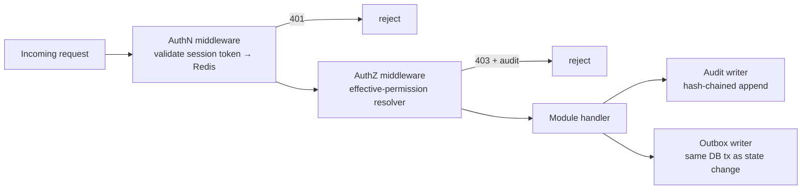

# 17 — Security Design

> Part of the STP platform design set — overview: [DESIGN.md](../../DESIGN.md) · index: [README.md](README.md)
> Source: former DESIGN.md §10 (security measures table) and §6 (cross-cutting components). Decisions, IDs and requirement text unchanged.

## Purpose

Make DevSecOps an architectural foundation rather than an add-on (design goal #2, C-05): SSO-only authentication, deny-by-default authorization, tamper-evident audit, secrets from CyberArk at runtime, and a uniform error model — each mapped to its SRS requirement.

## SRS requirements covered

- **NFR-SEC-001 … NFR-SEC-010** — see the measures table below.
- **C-09** — secrets from CyberArk at runtime (bootstrap dependency of every service).
- **FR-AI-003** — GenAI guardrail (see [07 — GenAI Assistant](07-genai-assistant.md)).
- **D-04 / D-05** (design decisions) — OIDC primary SSO; opaque server-side sessions in Redis.
- **TBD-11 / TBD-12** — encryption-at-rest provider detail; step-up authentication policy [P].

## Components

Cross-cutting components (from former §6):

- **AuthN middleware** — resolves the opaque session token from Redis (idle sliding 30 min, absolute 12 h).
- **AuthZ middleware** — decorator per route declaring the required permission; resolver as in [09 — RBAC & Authorization](09-rbac-authorization.md). Fail closed when permission data is unavailable (FR-RBAC-002 E1).
- **Audit writer** — single choke point; synchronous for security-critical events, async otherwise; attaches `correlation_id` propagated from the request's trace ID (see [13 — Audit Logging](13-audit-logging.md)).
- **Secret provider** — at startup and on demand, fetches DB/SMTP/API credentials from CyberArk CCP using the app's machine credential; refreshes before expiry; if unavailable at startup the service refuses to start (C-09, NFR-SEC-005).
- **Error model & trace IDs** — the SRS standard error envelope (§5.2 of SRS) implemented as a FastAPI exception handler; every response carries `traceId`.

Security measures (from former §10):

| SRS requirement | Design measure |
|---|---|
| NFR-SEC-001 SSO, no passwords | OIDC authorization-code flow via `authlib`; `User` has no password column |
| NFR-SEC-002 deny-by-default | AuthZ middleware (see 09); default-deny if resolver errors |
| NFR-SEC-003 TLS 1.2+ | TLS terminated at nginx proxy; service-to-service inside the deployment network over TLS [P: same-host docker network for MVP, mTLS deferred] |
| NFR-SEC-004 AES-256 at rest | Cloud-managed disk encryption + PostgreSQL TDE/volume encryption [P per TBD-11] |
| NFR-SEC-005 / C-09 secrets | Secret provider → CyberArk CCP; CI repo scan (gitleaks) blocks commits with secrets |
| NFR-SEC-006 session expiry | Redis sessions, 30 min idle / 12 h absolute; revocation invalidates permission cache and session permission snapshot |
| NFR-SEC-007 input validation | Pydantic models on every boundary; SQLAlchemy parameterized queries; pip-audit + OWASP checks in CI |
| NFR-SEC-008 tamper-evident audit | SHA-256 hash chain + scheduled chain-verification job + DB-level write restrictions |
| NFR-SEC-009 rate limiting | nginx limit_req on public endpoints; login backoff [P policy] |
| NFR-SEC-010 step-up auth | Break-glass + checkout require fresh SSO re-authentication [P, TBD-12] |
| FR-AI-003 GenAI guardrail | Assistant has no trading permissions; tool whitelist read-only; suggestions become tickets only via UI confirmation |

## Flows

Request pipeline (cross-cutting; also shown in [09 — RBAC & Authorization](09-rbac-authorization.md)):

## Data entities used

- `User` — no password column (NFR-SEC-001).
- `AuditEvent` — hash-chained append-only store (see 13, 16).
- Redis: `sess:*` (opaque sessions, D-05), `perm:{user}` (permission cache; invalidated on revocation, NFR-SEC-006).

## API endpoints used

- Applies platform-wide: every response carries the standard error envelope with `traceId` (SRS §5.2; FastAPI exception handler).
- TLS 1.2+ terminated at the nginx reverse proxy (NFR-SEC-003); nginx `limit_req` rate limiting on public endpoints (NFR-SEC-009).

## Error / edge cases

- **Permission data unavailable** — fail closed (FR-RBAC-002 E1; see 09).
- **Secret provider unavailable at startup** — the service refuses to start (C-09, NFR-SEC-005); CI repo scan (gitleaks) blocks commits with secrets.
- **Resolver error** — default-deny (NFR-SEC-002).
- **Step-up required** — break-glass and checkout require fresh SSO re-authentication [P, TBD-12] (NFR-SEC-010; see 11, 12).
- **Assistant misuse** — the GenAI identity holds no trading permissions; direct API misuse is denied by default and logged as a security event (FR-AI-003; see 07).

## Acceptance criteria mapping

- **AC-018** — route-level permission declarations on all routes, verified by an automated test (see 09; contract-test level in 19).
- **AC-014** — fail-closed dependency tests and the hash-chain tamper test (security-test level, see [19 — Testing Strategy](19-testing-strategy.md)).
- **Deny-by-default sweep** — security-test level (see 19).
