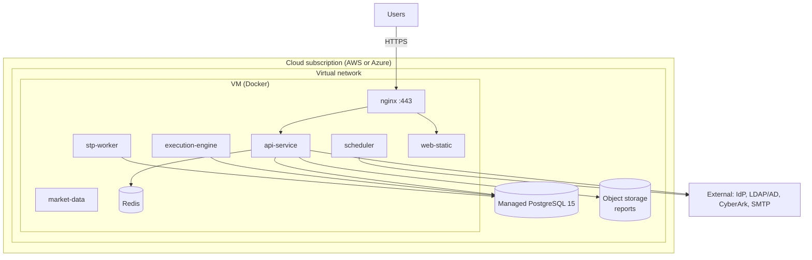
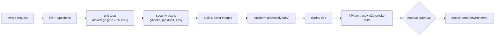

# 18 — DevOps & Deployment

> Part of the STP platform design set — overview: [DESIGN.md](../../DESIGN.md) · index: [README.md](README.md)
> Source: former DESIGN.md §11 (deployment architecture and CI/CD pipeline). Decisions, IDs and requirement text unchanged.

## Purpose

Define how the MVP is provisioned, deployed and delivered: Docker containers on a single cloud VM per environment with managed PostgreSQL (D-06), Terraform-provisioned and cloud-portable (C-03), with a CI/CD pipeline that tests and scans every merge before deploy (NFR-MNT-001/002/006).

## SRS requirements covered

- **D-06 [P]** (design decision) — single cloud VM per environment (dev, demo) with managed PostgreSQL; trades NFR-AVL-004 (multi-AZ, a *Could*) for delivery speed.
- **C-02** — IaC and CI/CD (Terraform, GitLab CI/CD, Docker; D-03).
- **C-03** — cloud portability: no hard dependency on AWS- or Azure-only services.
- **NFR-AVL-004** — multi-AZ, a Could, consciously deferred (D-06).
- **NFR-MNT-001/002/006** — CI/CD with tests, scans and coverage gate.
- **NFR-MNT-003** — structured logs and metrics endpoint per service, feeding the health view.
- **TBD-11** — cloud provider unconfirmed; Terraform written provider-portable.

## Components

- **Deployment unit** — Docker containers on a single cloud VM per environment (dev, demo): nginx :443, api-service, execution-engine, stp-worker, scheduler, market-data, web-static, Redis; plus managed PostgreSQL 15 and object storage for reports.
- **Terraform** — manages VM, network, managed DB, object storage; environment = workspace/variable set → cloud-portable (C-03).
- **CI/CD pipeline** (GitLab) — lint + typecheck → unit tests (coverage gate 70% core) → security scans (gitleaks, pip-audit, Trivy) → build images → terraform plan/apply (dev) → deploy dev → API contract + e2e smoke tests → manual approval → deploy demo.
- **Observability** — structured JSON logs with correlation IDs shipped to a central store; metrics endpoint per service feeding the health view (NFR-MNT-003; see [15 — Admin & Governance](15-admin-governance.md)).
- **Trunk-based development** — MR review; every merge runs tests and scans before deploy.

## Flows

Deployment architecture (D-06):

CI/CD pipeline (NFR-MNT-001/002/006):

## Data entities used

None directly — infrastructure only. Persistent state lives in managed PostgreSQL, Redis and object storage per [16 — Data Design](16-data-design.md).

## API endpoints used

None directly — infrastructure only. The per-service metrics endpoint (NFR-MNT-003) feeds the health view (see 15); public traffic enters via nginx :443 (TLS, see [17 — Security Design](17-security-design.md)).

## Error / edge cases

- **Availability trade-off** — NFR-AVL-004 (multi-AZ, a *Could*) is consciously traded for delivery speed (D-06); the stateless design keeps a later move to a managed container orchestrator (ECS/AKS) mechanical.
- **Provider unconfirmed (TBD-11)** — Terraform is written provider-portable across AWS/Azure until confirmed (C-03).
- **Pipeline gates** — security scans (gitleaks, pip-audit, Trivy) and the coverage gate (70% core) block promotion; demo deploy requires manual approval.

## Acceptance criteria mapping

- **NFR-MNT-001/002/006** — realized by the pipeline itself (tests, scans, coverage gate run on every merge).
- **NFR-MNT-003** — logs/metrics feed the health view (FR-ADM-002, see 15).
- The week-3 performance and security test pass runs against this deployment (delivery plan, DESIGN.md §8; test detail in [19 — Testing Strategy](19-testing-strategy.md)).
