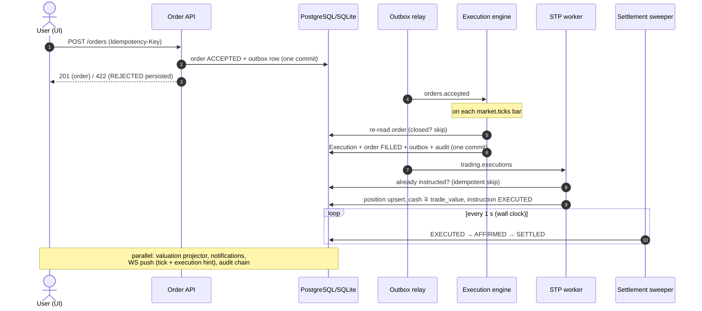
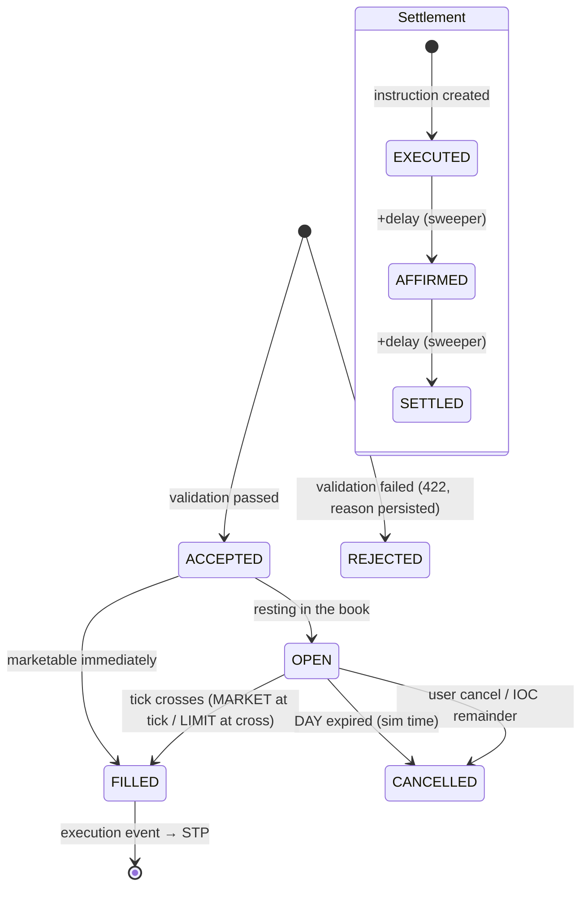

# Trade lifecycle — explainer (verified against the code)

How an order actually travels through STP, from the BUY button to SETTLED —
plus what happens when things fail, and why partial fills don't exist (yet).
Sources: `frontend/src/components/OrderPanel.tsx`,
`backend/app/modules/orders/{api,validation,workers}.py`,
`backend/app/modules/marketdata/worker.py`, `backend/app/core/events.py`.

## 1. The happy path, stage by stage

### 1. Order entry (UI)
Instrument picked from the tape or symbol search (equity/bond scoped). Price
fields re-anchor to the instrument's last price. BUY/SELL opens the
**two-click confirm card** (instrument, side, type, qty, est. cost — bond-aware
`face × price / 100` — cash before/after). Only at **Confirm** is an
**idempotency key** minted and `POST /api/v1/orders` sent. Esc/Cancel = nothing
leaves the browser.

### 2. Acceptance (`orders/api.py` + `validation.py`)
One transaction:
- AuthZ: `ORDER_SUBMIT` (deny-by-default, denials audited).
- Idempotency: duplicate key → returns the existing order, never a second one.
- Validation: tradable instrument; live, fresh price feed; qty positive and
  lot-aligned; **cash** (BUY) / **holdings** (SELL) via bond-aware
  `trade_value()`; per-order notional cap; restricted-instrument list.
- Fail → order persisted `REJECTED` with reason + 422 envelope (`traceId`).
  Pass → order persisted `ACCEPTED` **and** an `orders.accepted` outbox row in
  the same commit — the event can't be lost between DB and bus.

### 3. Matching (execution engine, `orders/workers.py`)
Outbox relay → bus → engine (one queue for `orders.accepted` + `market.ticks`).
In-memory book per instrument, rebuilt from the DB at startup. Per tick, per
working order, in its own transaction:
- Re-reads the order; closed orders are skipped (cancel/fill race guard).
- DAY past `expire_after` (sim time) → expires.
- STOP → MARKET on trigger; STOP_LIMIT → converts to LIMIT (`STOP_TRIGGERED`
  audit); TRAILING_STOP rolls the water-mark first, then checks.
- MARKET fills at the tick price (bar close); LIMIT fills on cross; IOC cancels
  the unfilled remainder.
- Fill → `Execution` row, order `FILLED`, `trading.executions` event +
  `ORDER_FILLED` audit — one commit.

### 4. STP worker
Consumes `trading.executions`. **Idempotent** (existing SettlementInstruction
→ return). One transaction:
- Position upsert: BUY → qty up, weighted `avg_cost`; SELL → qty down
  (realized P&L computed on read).
- Cash `∓ trade_value()` (bonds: face × price / 100).
- `SettlementInstruction` created in state `EXECUTED` + `stp.lifecycle` event.

### 5. Settlement (sweeper)
1-second sweep: `EXECUTED → AFFIRMED → SETTLED` on wall-clock delay
(`SETTLEMENT_DELAY_SECONDS`, 5 s default). This is the state machine visible
in the blotter's Settlement column — and what `» +1d` lets you watch at speed.

### 6. Parallel effects
- **Valuation projector**: snapshot per execution + every 30 s → KPI series
  (volatility, VaR/ES, drawdown, Sharpe).
- **Notifications**: in-app rows (email is an honest log-line mock).
- **Push channel**: ticks broadcast; execution hint → owner → positions flash.
- **Audit**: hash-chained, append-only, at every security-relevant step.

## 2. Sequence diagram

## 3. State machines

## 4. When a trade fails — by stage

| Stage | Failure | Outcome |
|---|---|---|
| Validation | cash/holdings, notional cap, restricted, stale feed, bad lot | order `REJECTED` (reason persisted) + 422 envelope; nothing downstream |
| Idempotency | duplicate key | the *existing* order returned — never a double fill |
| Cancel vs fill | race | engine re-reads; closed order skipped; loser discarded |
| Feed quiet | no ticks | order rests "working", retried on later ticks (no invented failure) |
| Time-based | DAY / IOC | `CANCELLED` with `ORDER_EXPIRED` / `IOC_UNFILLED`, audited + notified |
| Redelivery | crash between publish and mark | at-least-once bus; every consumer idempotent — invisible |
| STP processing | exception in position/cash/instruction | `STP_EXCEPTION` audit (HIGH) + owner notified + Governance list + ops **retry** endpoint (idempotent re-drive) |
| Reports | render failure | row `FAILED` + `REPORT_FAILED` audit + clear 409 on download |

Known honest gap: the notification worker is not idempotent — a redelivery can
duplicate a notification row (cosmetic, documented).

## 5. Partial fills — "10 at $100, only 5 on the market"

**It can't happen here, by design.** The sim "market" is the replayed price
stream — no order book, no liquidity constraint. A LIMIT BUY at $100 fills
**all 10 at the first tick whose close ≤ $100** (at the tick price, possibly
better). If no tick reaches $100 before sim day-end (DAY TIF), the order
**expires with zero filled**. Strictly all-or-nothing: 10 filled, or 0 with
expiry/cancel.

`PARTIALLY_FILLED` exists in the order-status enum (reserved; the UI already
tolerates it) but the engine never sets it — partial fills and the
slippage/liquidity model were explicitly scoped out of the MVP (TBD-14: "add
only if a trader complains").

If ever wanted: cap fills by bar volume (`min(remaining, bar_volume ×
participation%)` per tick), flip to `PARTIALLY_FILLED` with a `filled_qty`
column, keep working the remainder, show remaining qty in the UI.

## 6. The one-sentence version

Every state change commits *with* its event in one transaction (transactional
outbox), every consumer is idempotent, and the UI only reflects what the
pipeline committed — that is what "straight-through with zero manual steps"
concretely means here.
