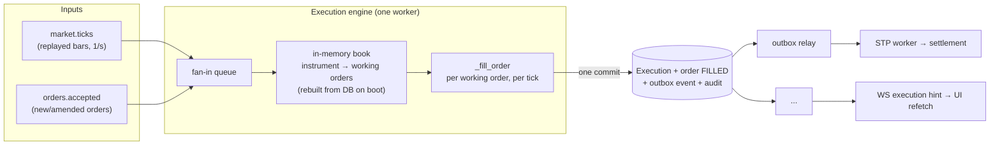
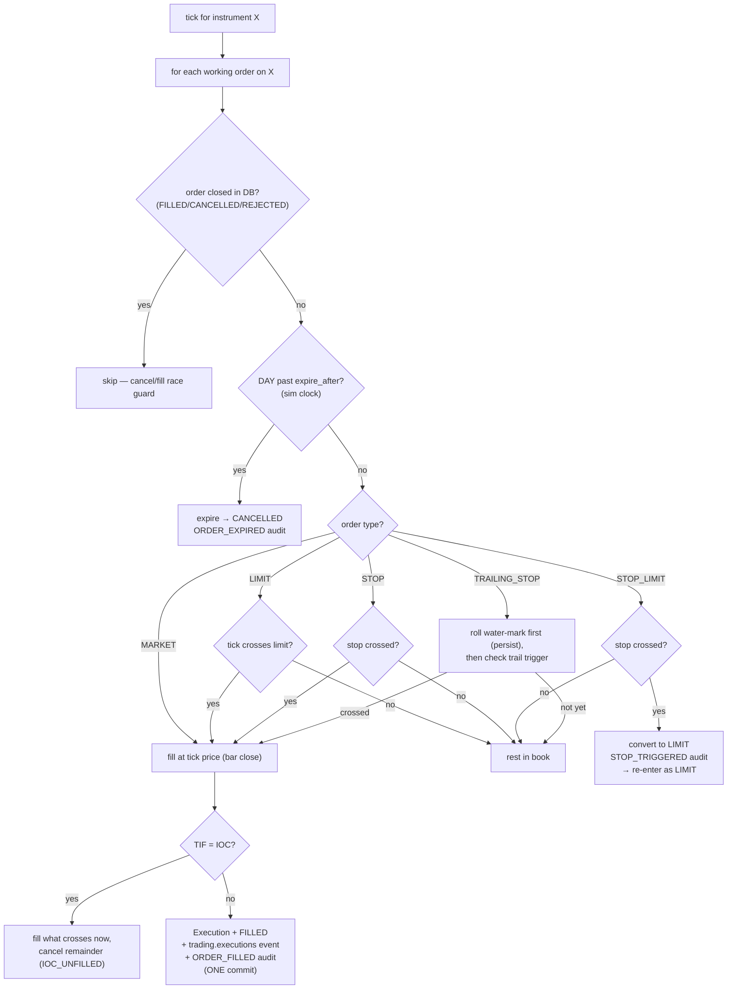
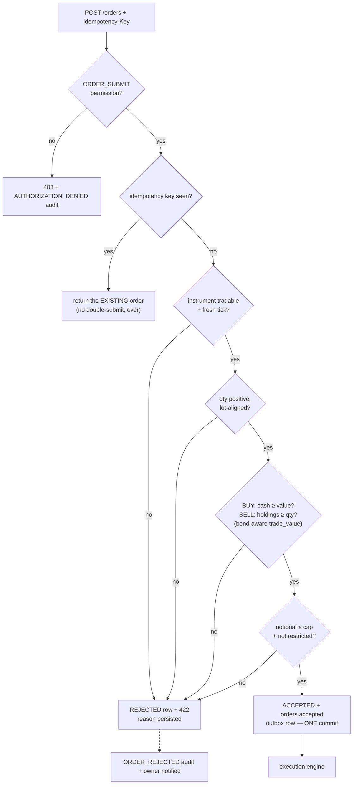
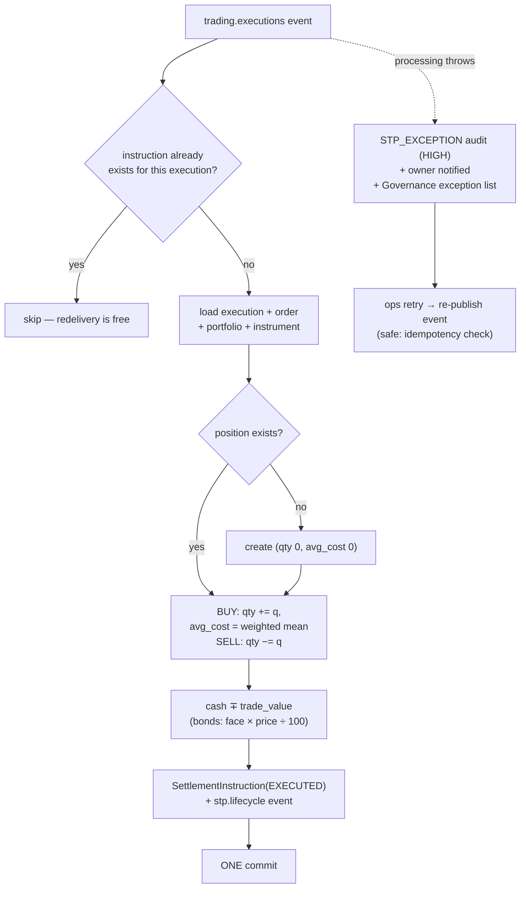
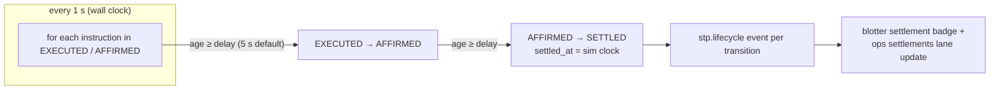

# 5-minute demo — stage script (exactly what to do and say)

Companion to `demo-5min.md` (the spine). This is the runbook: every click and
every line, beat by beat. Every UI string below was verified against the code
(`frontend/src/**`, `backend/app/**`) on 2026-08-04 — quote them confidently.

**One choreography change vs the beat sheet:** beat 4 adds a 10-second UL
micro-trade. Reason: settlement hops run on a ~5 s wall-clock sweeper
(`SETTLEMENT_DELAY_SECONDS=5.0`, sweeper every 1 s), so the IBM row from beat 2
is already SETTLED by 1:50 — without a fresh trade there is no live walk to
watch. `» +1d` compresses *market* time; it does not drive settlement — the
script below narrates the two as separate facts.

Timing discipline: rehearse to **4:30**; the room adds 20%. Lines marked
*(drop if late)* are the first cuts. Spoken word count ≈ 560 — a calm pace.

---

## Pre-flight checklist

**T-30 min**
- [ ] `./dev.sh sqlite` running; `GET /api/v1/health` → 200; UI loads on :5173.
- [ ] Dataset actually loaded: top bar shows the **`SIM LIVE`** dot and the SIM
      clock (`SIM MM-DD HH:MM`) advances. If not, the random-walk fallback is
      running and `» +1d` will return 409 — restart with `data/` present.
- [ ] `backend/.env` still has `REPLAY_START=2026-08-24` (late-August sim
      dates on stage). Restart the backend now so risk numbers are fresh.
- [ ] **Do not reset `backend/stp.db`.** The Desk Book 1 history (MSFT ≈74%
      concentration, UST10Y/AAPL29/UST2Y bonds, realized P&L from the TSLA
      sell) was placed manually on 2026-08-02 — the seed does NOT recreate it.
      Verify: Portfolios → Desk Book 1 shows those positions; Concentration
      donut ≈74%.
- [ ] **IBM, UL, MSFT31 untouched** — no positions in them (they are the live
      trades: IBM beat 2, UL beat 4, MSFT31 reserved for Q&A).
- [ ] Window 1: logged in `trader@demo.nomura`, on the Trading workspace.
      Window 2: logged in `ops@demo.nomura`, on **Governance & Health**.
      No logins happen on stage.
- [ ] LLM live? Hotspot connected, send one warm-up assistant query, and check
      window 2: the `llm` tile shows UP with detail `live: <model>`. If it
      shows `down: <reason> — using mock` or `mock: not configured`, use the
      mock-variant lines in beat 5 — the flow is identical.
- [ ] Browser zoom 125–150%; video fallback cued:
      `tools/demo-recorder/recordings/demo-2026-08-02T05-17-35-726Z.webm`.

**T-1 min**
- [ ] Window 1 focused, tape ticking. Breathe.

---

## Beat 1 — Open (0:00–0:25) · window 1, workspace

**DO** — nothing yet; the screen is the opening. Gesture: tape → chart → SIM clock.

**SAY**
> "What you're looking at is a live trading platform. The tape is ticking,
> candles are drawing, and this clock, top right, is a *simulation* clock —
> the platform replays a real market dataset at one minute-bar per second, a
> market day in about six and a half minutes. Nothing in the system knows the
> data is simulated. Every number you'll see comes out of the real pipeline."

---

## Beat 2 — Trade (0:25–1:15) · window 1, workspace

**DO**
1. Click the **`IBM`** chip on the tape (chart and order panel switch to IBM).
2. In the **Order entry** panel: click the size input and **type `25`** —
   the chips are only 10/50/100, so type it.
3. Click **`BUY`** → the `Confirm BUY` modal opens. Hold a beat on it:
   Est. cost, Cash before, Cash after.
4. Press **`Enter`** (equals clicking `Confirm BUY (Enter)`; `Esc` cancels).
5. Toast `BUY 25 IBM accepted` appears at once; a few seconds later
   `BUY 25 IBM filled @ …`. Point at the positions table — the **Mark**
   cells flash green/red as ticks arrive.

**SAY**
> "Rohan — our head of product — asked for single-click trading. What we
> shipped is one *informed* decision. I pick IBM on the tape, size
> twenty-five, one click on BUY — and this is the click that matters: a
> confirmation with the full cost impact. Estimated cost, cash before, cash
> after. Second click.
>
> *(toast)* Accepted — and filled at the market, in seconds. That fill went
> through the real pipeline: validation, an execution engine matching it
> against the live tick stream, positions and cash updated *(drop if late:
> — and a settlement instruction created, which you'll see in a moment)*.
> No manual step anywhere."

---

## Beat 3 — Risk (1:15–1:50) · window 1, workspace (same page, scroll down)

**DO** — move to the **Risk exposure** panel at the bottom of the workspace.
Point in order: the four donuts → the Bond book line → Top holdings.

**SAY**
> "Same screen, the risk panel — recomputed live from the positions. Four
> donuts: concentration, annualized volatility, one-day VaR and expected
> shortfall — and they just reacted to the IBM buy. This desk is seventy-plus
> percent Microsoft, which is why concentration is red.
>
> And because the book holds bonds, there's a bond-book line: weighted
> yield-to-maturity and modified duration. *(drop if late: A bond is not a
> stock with a different symbol — it's priced as percent of par, with proper
> cash math.)*"

---

## Beat 4 — STP payoff (1:50–2:35) · window 1, workspace → Trades

**DO**
1. Quick second trade for a live lifecycle: click the **`UL`** chip, click
   the **`10`** size chip, **`BUY`**, **`Enter`**. (~10 s, no narration
   needed beyond the line below.)
2. Click **`Trades`** in the sidebar → **Trade Blotter**.
3. Top row, **Settlement** column: watch the badge walk
   `EXECUTED` → `AFFIRMED` → `SETTLED` (~5 s per hop; if it's already
   SETTLED, use the alternate line).
4. Press **`» +1d`** in the top bar, twice. Toast: `Replaying one market day
   at full speed`. The SIM clock races through two days; the tape keeps
   ticking.

**SAY**
> "Now the payoff: straight-through processing. One more trade — UL, ten
> shares, same two clicks — and watch the settlement column in the blotter.
> The instruction is born with the fill: EXECUTED… AFFIRMED… SETTLED. Seconds,
> and nobody touched it.
>
> *(alternate if already settled: "This row settled eight seconds after the
> fill — the timestamps are right there.")*
>
> And because the clock is ours, I can compress time. One button replays a
> whole market day at full speed — every tick processed. Two market days, in
> seconds."

---

## Beat 5 — AI agent (2:35–4:00) · window 1, Assistant tab

**DO**
1. Click **`Assistant`** in the sidebar.
2. Type **exactly** `Help me buy 10 stocks of APPL at market price` → Enter.
   (This is the test-suite sentence; APPL resolves via the instrument-name
   match.) Watch the reply stream in.
3. Point at the clarification: *"Just to be sure: did you mean AAPL (Apple
   Inc.)? … Reply 'yes' to continue or 'no' to cancel."*
4. Type `yes` → Enter. The answer streams; a **Suggested ticket: BUY AAPL ×
   10** bubble appears with a **`Review ticket`** button.
5. Click **`Review ticket`** → the standard order ticket opens, prefilled.
   Show it two seconds. **`Esc`** — do NOT submit.
6. Type `what about its sentiment?` → Enter. It resolves "its" to AAPL from
   the conversation and streams the sentiment answer with the dataset
   headlines behind it.

**SAY**
> "Now the GenAI agent — and notice the typo: A-P-P-L. *(send)* The reply
> streams in live. It doesn't guess — it asks: did you mean AAPL, Apple?
> Yes. *(send)*
>
> Now the important part: it does **not** trade. It prepares a suggested
> ticket — Review ticket — and it lands in the *standard* order ticket. Same
> validation, same two-click confirm as any human order. Advisory only; the
> decision is always mine. I'll close it without submitting.
>
> And the conversation has memory: 'what about its sentiment?' — it knows
> 'its' is Apple, and it answers from our own news dataset, headlines
> included. It refuses to invent numbers it doesn't have.
>
> *(live LLM:)* It's running on a live model right now — the next window
> proves it — but one config file is the whole difference; unreachable model,
> it falls back to the rule-based mock and keeps working.
> *(mock variant:)* Right now it's the rule-based mock, honestly labeled.
> One config file points it at any OpenAI-compatible model, a startup
> self-check takes it live, and unreachable means it falls back here. That
> fallback is the resilience story, not a caveat."

*(If running late: skip step 6 and its two sentences — saves ~15 s.)*

---

## Beat 6 — Ops + honesty (4:00–4:45) · window 2 (pre-logged as ops)

**DO** — switch windows. On **Governance & Health**, point in order:
integration tiles (`directory`, `cyberark`, `smtp` with their `mock` chips,
`market_feed`, `llm` showing `live: <model>`) → **STP exceptions** lane
(`No STP exceptions — pipeline is clean.`) → **Recent settlements** lane
(IBM and UL rows, SETTLED).

**SAY**
> "The same story from the middle office — this window is logged in as our
> operations analyst. Integration health across the top: the LLM tile, live
> on the model *(mock variant: honestly badged mock)* — and directory and
> SMTP carry mock badges. Every seam we faked is *labeled* a mock. Honest
> seams, not fake green.
>
> STP exceptions: none — pipeline clean. If one ever stuck, ops retries it
> from this screen. And the recent-settlements lane: the IBM and UL trades
> you just watched happen — settled."

---

## Beat 7 — Close (4:45–5:00) · back to window 1

**DO** — switch back. Tape still ticking. Face the room.

**SAY**
> "Underneath all of it: deny-by-default permissions on every request, and a
> hash-chained, append-only audit trail — tamper-evident by construction.
> One order, from click to settled, wrapped in enterprise controls.
> Questions?"

---

## Recovery lines (never debug on stage)

- **Fill toast is slow** (market fills on the next tick; toast within ~5 s):
  keep talking — "the toast polls every few seconds; meanwhile the tape
  keeps ticking."
- **`» +1d` errors** (only if the fallback feed is running — pre-flight
  catches this): "the clock loops the dataset on its own — the point is the
  pipeline processes every tick." Move on.
- **LLM / hotspot dies mid-assistant:** the stream silently falls back and
  mock answers deterministically — "and *that* is why the mock exists: same
  grounding, same guardrails." Continue the beat in mock.
- **Anything on fire:** switch to the 40 s video, narrate beats 1–4 over it,
  say plainly the fallback is running, offer to retry live during Q&A.

## Cut-if-late ladder (in order)

1. Beat 4: drop the UL micro-trade, use the alternate "timestamps" line (−12 s).
2. Beat 5: drop the sentiment follow-up (−15 s).
3. Beat 6: tiles only, skip the two lanes (−20 s).
4. Beat 3: drop the bond-book sentence (−8 s).

## After the demo — Q&A ammo, one click away

Bond trade on MSFT31 (tape scope toggle `Bonds` — it lives *on the tape*,
not the top bar), access-request approval, break-glass, audit hash chain,
paper trading, report generation, the `/connect` phone page. See
`demo-5min.md` §"Cut on purpose" and `demo-guide.md` for those walkthroughs.

---

## Q&A — Risk-exposure metrics (what they mean, how computed, why these)

Every figure on the Risk Exposure panel is computed from the portfolio's
**daily total-value series** (market value + cash), one point per day.
Source: `ValuationSnapshot` history; when the book is too new for 10 days of
snapshots, we fall back to repricing today's book through stored daily closes
("how would this exact book have moved"), so the KPIs are meaningful from day
one instead of N/A. `backend/app/modules/portfolios/valuation.py`.

**Concentration (%)** — the single largest holding's share of market value.
- *How:* `top_holdings[0]["pct"]` — max position value ÷ total market value.
- *Why:* the one-number answer to "how diversified is this book?" Regulators
  and risk limits frame concentration first because idiosyncratic risk is the
  easiest to blow up on. Ours reads 100% on a one-stock demo book — a great
  talking point, not a bug.

**Volatility, annualized (%)** — how violently the book's value swings.
- *How:* `stdev(daily total values) × √252 ÷ mean × 100`, needs ≥ 10 daily
  points (252 = trading days/year).
- *Why:* the universal risk yardstick — every other metric (VaR, limits,
  margin) starts from vol. A trader compares it against the market's vol to
  know if they're running hot.

**VaR 95%, 1-day (%)** — "on a bad day (1 in 20), expect to lose at least
this much, as % of book value."
- *How:* historical simulation — the 5th percentile of daily returns,
  negated: `VaR = max(0, −q5) × 100`. Not parametric, no normal-distribution
  assumption — it just ranks real observed days.
- *Why:* the industry-standard headline risk number since the 1990s; it's
  what risk committees quote and what limits are written against. 95% 1-day
  is the Basel-flavored convention.

**ES / CVaR 95%, 1-day (%)** — "when the worst 5% of days *do* happen, the
average loss is this."
- *How:* mean of all daily returns at or below the 5th percentile, negated.
  Always ≥ VaR by construction.
- *Why:* VaR tells you where the cliff edge is, ES tells you what's *below*
  it — it catches fat tails that VaR hides. Post-crisis regulation (FRTB)
  moved from VaR to ES for exactly this reason; having both on the panel
  shows we know the difference.

**Sharpe ratio, annualized** — return earned per unit of risk taken.
- *How:* `mean(daily returns) ÷ stdev(daily returns) × √252`, risk-free rate
  = 0 (documented training simplification).
- *Why:* the honest "was it worth it?" metric — a book up 10% on 30% vol is
  worse than one up 6% on 5% vol. It stops traders from celebrating raw P&L.

**Max drawdown (%)** — the worst peak-to-trough fall the book has suffered.
- *How:* running peak of daily total value; `max((peak − value) ÷ peak) × 100`.
- *Why:* the metric every investor *feels* — "how much pain, worst case, did
  sitting through this book cost?" VaR is forward-looking probability;
  drawdown is the lived worst case. Fund mandates often cap it explicitly.

**Day change ($ and %)** — today's move vs the previous day's open, per
position and in total.
- *How:* mark-to-market at latest tick vs `prev_day_open` per instrument,
  summed. (On the sim clock, "day" is dataset day.)
- *Why:* the number a trader checks first each morning; everything else on
  the panel is context for it.

**If asked "why no Greeks / beta / factor exposures?"** — this is a
cash-equity-and-bond book with no derivatives and no factor model in the
dataset; delta-1 metrics plus vol/VaR/ES/DD is the honest, complete set for
it. The valuation seam (`_daily_total_values`) is exactly where a beta or
factor series would plug in.

---

## Q&A — How are Operations mapped to traders in the real world?

**Answer: many-to-many, organized as a desk-level queue — not a personal
hotline.** And that is what we built.

- **Reality (industry):** an operations team services a whole trading desk or
  business unit — dozens of traders — through a shared exception queue with
  triage and SLAs, first-available analyst picks items up. It's many-to-many:
  any trader can produce an exception, any qualified op can clear it.
  High-touch variants exist (a senior sales-trader pair may get a dedicated
  op — many-to-one), but that's the exception, not the model. Follow-the-sun
  ops (Tokyo → London → New York) makes queue-based assignment a necessity,
  not a choice — a fixed person is a single point of failure at 3 a.m.
- **Our design mirrors that:** failed orders and STP exceptions surface to a
  *role*, not a person — anyone holding `STP_EXCEPTION_HANDLE` (the
  Operations Analyst role) sees the queue and can act (design decision: the
  queue is the permission). The trader who owns the order is always notified
  too, so accountability stays with the originator while resolution stays
  with the team.
- **Why not route to "the trader's fixed op"?** Because at scale that
  assignment table is another thing to maintain, and it breaks the moment
  someone is out sick. Role-based queue = resilient by construction.
- **If asked about SoD:** the trader cannot clear their own exception —
  `ORDER_SUBMIT` (trader) and `STP_EXCEPTION_HANDLE` (ops) are separate roles
  in separate hands, which is the segregation-of-duties point compliance will
  ask about. The audit trail records who requeued what and why, so the
  queue is fast *and* accountable.

## Q&A — What is the outbox relay? ("How do you guarantee no step is lost?")

**Answer: the database keeps the promise, the relay is just the courier.**
Every state change commits *with* its event in one transaction — so a fill
can never exist without its settlement event, nor the reverse.

- **The problem it solves**: you can't write a database and publish a message
  atomically. Publish first and the commit fails → a phantom fill moves
  positions and cash. Commit first and crash before publishing → the fill
  exists but the STP worker never hears about it; settlement silently never
  happens — which FR-ORD-005 (zero manual steps) forbids.
- **The pattern**: the module writes the state row *and* an `OutboxEvent`
  row in **one DB commit** — both or neither. The relay is a background loop
  (every 0.2 s, batches of 100) that reads unpublished rows
  (`published_at IS NULL`), publishes them to the event bus, stamps them,
  commits. The DB is the source of truth for "what happened"; the relay only
  moves that fact onto the bus.
- **Why duplicates don't hurt**: a crash between publish and stamp means the
  row is republished — delivery is *at-least-once* by design, so every
  consumer is idempotent (the STP worker skips executions that already have
  an instruction; the engine skips closed orders; the projector swallows the
  unique-constraint hit). A redelivery is invisible; a lost event is
  impossible.
- **Resilience details worth quoting**: a failed batch logs and retries —
  it can't kill the relay or the other workers; and on shutdown an in-flight
  batch drains to completion (cancelling mid-DB-call can wedge aiosqlite —
  a war story we actually hit and fixed).
- **One-liner for stage**: "We don't try to make two systems atomic — we make
  the event a database row committed with the trade, and let a courier catch
  up. That's why the pipeline can claim zero manual steps."

*Code references if pressed: `backend/app/core/events.py` (`write_outbox`,
`outbox_relay`, `_relay_batch`); design doc §4.2 (D-02); the sequence diagram
in `presentation/trade-lifecycle.md` (PNG: `trade-lifecycle-sequence.png`).*

## Q&A — the nine questions we WANT to be asked (plant these with the room)

Each sounds like a challenge; each lands on our strongest ground. Answer
shapes are 20–30 seconds; fuller backup lives in the Q&A sections above.

### Technical showcase (4)

1. **"Between all these moving parts — engine, workers, bus — how do you
   make sure an order never gets lost or processed twice?"**
   *The database keeps the promise; the relay is just the courier.* State +
   event commit as one transaction; delivery is at-least-once and every
   consumer is idempotent, so a duplicate is invisible and a lost event is
   impossible. (Full answer: "outbox relay" Q&A above; show
   `trade-lifecycle-sequence.png`.)

2. **"Your market data is a replay — how is this not just a toy demo?"**
   *Nothing in the platform knows the data is simulated.* Real minute bars on
   a simulation clock; charts, staleness, news and even order timestamps all
   live in market time. And the clock is a dial — one clean minute-step per
   second, or a whole market day in two seconds with every tick processed.
   (Press `» +1d` as the punctuation mark.)

3. **"The AI can suggest trades — what's stopping it from placing one?"**
   *The architecture, not a prompt.* The agent has no order path; it produces
   a prefill ticket that goes through the same validation and the same human
   confirm. Guardrails were proven in mock mode before the real model was
   wired — the model only rewords data our engine grounds. (Show the
   APPL → "yes" → ticket flow if time allows.)

4. **"If you had three more weeks, what would you harden first?"**
   *Alembic migrations (the only TODO in the codebase); then exercise the
   Redis-backed stores + a multi-instance smoke (the process-local pieces pin
   us to one instance today); then the load test we designed but never ran.
   After that: order reservation accounting and per-desk limits.* Shows we
   know our own system cold.

### Business / operations / risk (5)

5. **"What happens when something in the flow breaks? Who fixes it?"**
   *Nothing fails silently.* A failed step raises a high-severity STP
   exception: audited, the owner notified, and it lands on the operations
   queue in Governance. Ops re-drives it with one click — the retry is safe
   because the worker is idempotent. Traders can't clear their own
   exceptions — that's segregation of duties. (Show the Governance page.)

6. **"What stops a trader from fat-fingering a catastrophic order?"**
   *Pre-trade controls, enforced before the order exists:* cash/holdings
   checks, a per-order notional cap, the restricted-instrument list, lot/tick
   validation — and the two-click confirm shows cost and cash-after before
   anything is submitted. In the real world this is the SEC Market Access
   Rule (15c3-5); ours is the training-scale version of the same idea, with
   per-desk limits on the roadmap.

7. **"How does compliance see who did what?"**
   *Every security-relevant action lands in an append-only, hash-chained
   audit trail* — each record hashes the previous one, so tampering with
   history breaks the chain and is detectable. Access is deny-by-default
   RBAC with time-bound grants; auditors get search + CSV/JSON export. (One
   click away: the auditor's Audit page.)

8. **"What does risk visibility look like for a trader or risk officer?"**
   *Live, on the same screen as the trade:* concentration, annualized
   volatility, 95% 1-day VaR *and* expected shortfall, max drawdown, Sharpe —
   and for bonds, weighted yield and modified duration. The metrics are
   computed from the book's daily series; a fresh book gets honest values
   immediately by repricing the current holdings through stored history.
   (Formulas: the risk-metrics Q&A above; show the four donuts.)

9. **"What happens if the market-data feed stops?"**
   *The platform degrades honestly instead of trading blind:* orders for an
   instrument with no fresh tick are rejected at validation, positions carry
   STALE badges, and the feed tile in Governance changes state. No fake
   prices, no silent fills — the same guard the SRS asks for (NFR-AVL-002).

## Appendix — Ops spotlight demo (~3 min, operations persona)

Purpose: show that Operations is a first-class user with a *job*, not a
read-only viewer. Pre-stage: one REJECTED order in the blotter (currently
**TSLA BUY 5,000 · REJECTED · MAX_NOTIONAL_EXCEEDED**, id
`3c769f07-faa3-43ae-90fd-0bb966b77c91`). Log in as `ops@demo.nomura` /
`demo1234` — ops lands on **Trades** (their home, by design).

**Beat 1 — "Ops watches the flow, not the chart" (0:00–0:30)**
Do: Trades blotter — all portfolios' executions, settlement column walking
EXECUTED → AFFIRMED → SETTLED.
Say: "Operations has no order panel — their business is the settlement
flow. They see every book's trades and their settlement states live."

**Beat 2 — "One dashboard for the pipeline's health" (0:30–1:15)**
Do: Governance page — integration health tiles (directory/smtp with honest
*mock* badges, market_feed, `llm · live`), STP exceptions (clean), Recent
settlements lane.
Say: "Every integration is probed and honest — mocks are labeled mocks, the
LLM tile shows the live model from the startup self-check. When the feed
goes down, this tile is where ops sees it first."

**Beat 3 — "A failed order, fixed and resubmitted" (1:15–2:30) — the money beat**
Do: Orders page → the REJECTED TSLA 5,000 row → **Requeue** → amend qty
5,000 → **400** → submit → watch it go ACCEPTED → FILLED within seconds.
Say: "The pre-trade controls stopped a million-dollar order — but rejection
isn't the end. Operations sees the failure in their queue, amends it, and
requeues. It re-runs the *full* validation — if it were still invalid it
would stay rejected with the reason. And note the segregation: the trader
can't clear their own rejected order — that's compliance, not convenience.
Everything is audited: who amended what, when, and why."

**Beat 4 — "And the settlement pipeline itself is repairable" (2:30–3:00, optional)**
Say (no live exception needed): "If the settlement step itself ever fails,
the same page shows the STP exception, and ops re-drives it with one click —
safe, because the worker is idempotent: a retry can never double-post."
Do (if asked): point at the STP exceptions panel.

**Q&A hooks for this persona**
- "Can ops trade?" — No. `ORDER_SUBMIT` isn't in their role (SoD, by design).
- "Can they see client books?" — Oversight is read-only (`PORTFOLIO_VIEW_ALL`
  = see, never touch); remediation is limited to exceptions.
- "Can they request more access?" — Yes, via Access Requests — same
  approval chain as everyone.

## Q&A — Chart indicators (what each shows, how computed)

If asked "what do SMA/EMA/BB/RSI/MACD mean on your chart?" — all five are
computed **server-side from our own candle history** (daily closes for wide
timeframes, minute bars for 1D), with a warm-up window so the lines start at
the first visible candle. Parameters below are the live implementation
(`backend/app/modules/analytics/indicators.py`).

**SMA — Simple Moving Average (20 periods, yellow overlay)**
- *What it shows:* the trend's center line — above it = bullish bias, below = bearish.
- *Formula:* mean of the last 20 closes: `SMA_t = (P_{t-19} + … + P_t) / 20`.

**EMA — Exponential Moving Average (20 periods, blue overlay)**
- *What it shows:* same trend story as SMA but **faster** — recent bars weigh
  more, so it turns earlier. SMA vs EMA divergence is a momentum tell.
- *Formula:* seeded with the 20-bar SMA, then recursive:
  `EMA_t = (P_t − EMA_{t-1}) · k + EMA_{t-1}`, where `k = 2 / (20 + 1)`.

**BB — Bollinger Bands (20 periods, ±2σ, grey envelope)**
- *What it shows:* volatility as a band around the mean. Bands **squeeze**
  before a breakout and **widen** during trends; price hugging the upper
  band = strength, riding the lower band = weakness.
- *Formula:* middle = SMA(20); upper/lower = middle ± 2 × population
  standard deviation of the last 20 closes.

**RSI — Relative Strength Index (Wilder's, 14 periods, purple sub-pane)**
- *What it shows:* momentum 0–100. Above 70 ≈ overbought, below 30 ≈
  oversold (the dashed guide lines on the pane); the mid-line at 50 splits
  bullish from bearish momentum.
- *Formula:* `RSI = 100 − 100 / (1 + RS)`, `RS = avgGain / avgLoss` over 14
  bars. First averages are simple means; afterwards Wilder smoothing:
  `avg_t = (avg_{t-1} · 13 + current_t) / 14`.

**MACD — Moving Average Convergence Divergence (12/26/9, sub-pane)**
- *What it shows:* trend + momentum together. The MACD line crossing the
  signal line up = buy momentum building (down = fading); the histogram
  visualizes the gap's growth/shrink.
- *Formula:* line = `EMA(12) − EMA(26)`; signal = `EMA(9)` of the line
  (seeded with the SMA of the first 9 line values); histogram = `line − signal`.

**One-liner for stage:** "Overlays ride on the price pane — moving averages
and bands; oscillators get their own panes — RSI for momentum, MACD for
trend-plus-momentum. All computed from our stored bars, so they work on
every timeframe the platform serves."

## Q&A — Equities vs bonds: what differs in the real world, and in our build?

### Part 1 — the real world

**Market structure (the deepest difference).** Equities trade on centralized
exchanges with a *central limit order book*: lit bids/asks, continuous
matching, pre-trade transparency. Bonds trade predominantly **OTC** — dealer
markets with no central order book and fragmented liquidity. The default
institutional mechanism is **RFQ (request-for-quote)**: you ask several
dealers for a firm price on a specific bond and size, quotes come back with
a short validity window, and you trade on the best one. Electronic platforms
(MarketAxess, Tradeweb) digitized the RFQ, not the order book.

**Conventions.** Equities: price per share, quantity in shares, small ticks.
Bonds: quoted as **% of par** (100.25 = 100.25% of face), quantities in
**face value** (lots of 1,000+), and the number people actually negotiate is
often the **yield** — price is derived. Analytics matter at the ticket:
coupon, maturity, YTM, modified duration/DV01, plus **accrued interest**
between clean and dirty price. Settlement conventions differ too (equities
T+1, bonds T+1/T+2 by market).

**UI differences in a real system.** Equity ticket: last price, bid/ask,
shares. Bond ticket: face amount, **yield ↔ price conversion**, accrued
interest and cash total, settlement date, spread-to-benchmark — and an RFQ
blotter (dealer quotes with countdowns) instead of an order book.

**Workflow.** Equity: order → exchange → match. Bond: RFQ → competing
quotes → trade on best quote → allocation/confirmation → settlement.

### Part 2 — in our system (the honest mapping)

Same pipeline by design — one order path, one STP flow, one audit trail —
with bond-correct math and conventions on top:

| Area | Equities | Bonds in STP |
|---|---|---|
| Quote | $ per share | **% of par** (e.g. 99.31) |
| Quantity | shares | **face value, lot 1,000** |
| Cash math | qty × price | **face × price ÷ 100** — one shared `trade_value()` helper (validation, STP, valuation, reports, UI est. cost) |
| Analytics | SMA/EMA/RSI/MACD/BB | **Bond card**: coupon, maturity, YTM (bisection solve), modified duration, yield → implied price |
| Risk view | allocation KPI | **EQUITY vs BOND split** in the donut and mix bar; weighted YTM + duration line on the book |
| Universe | 7 dataset equities | 4 bonds (UST10Y, UST2Y, AAPL29, MSFT31); tape/search have the Equities｜Bonds scope toggle |
| Workflow | order → match → STP | same pipeline (RFQ deliberately not modeled — see below) |

**Deliberate simplifications (say them proudly if asked):** no RFQ workflow
(our matcher fills at the replayed tick — the honest reason: no dealer
quotes exist in the dataset); **clean price only, no accrued interest**;
coupons don't pay out; settlement sweeps on the same cadence for both asset
classes (no T+1/T+2 split); modified duration but no convexity/DV01. Bond
prices are generated (the dataset is equities-only) — disclosed on the
honesty slide.

**One-liner for stage:** "The pipeline treats both asset classes identically
— that's the point of STP — but the *conventions* are bond-correct: percent
of par, face-value lots, yield and duration math. What we didn't fake is the
OTC RFQ workflow, and we'll say so."

## Q&A — The execution engine, in detail ("who plays the exchange?")

**Answer: a single in-process worker that acts as the matching engine of our
simulated exchange** — it owns the working-order book, evaluates every
resting order on every tick, and commits fills atomically with their events.
Code: `backend/app/modules/orders/workers.py` (`build_execution_engine`,
`_fill_order`).

### What it consumes and produces

- Two subscriptions (`market.ticks`, `orders.accepted`) are pumped into one
  `asyncio.Queue`, so ordering per instrument is total and single-threaded —
  no parallel matching races by construction.
- The book is **rebuilt from the database on startup** (OPEN + ACCEPTED
  orders), so a crash mid-flight loses nothing; the DB, not memory, is the
  authority.

### The per-tick decision tree (`_fill_order`)

Key invariants worth quoting:

- **Whole fills only**: fills happen at the tick price for the full quantity —
  no partial fills in the MVP (`PARTIALLY_FILLED` is reserved in the enum).
- **Matching is on bar closes**, not intra-bar extremes — a stop won't fire on
  a wick, only on a close through the level. Verified behavior, and consistent
  between normal replay and the `» +1d` flush.
- **The trailing-stop rule**: roll the water-mark *first*, then check the
  trigger — a tick can never trigger on the extreme it just set.
- **The fill commit is atomic**: Execution + FILLED status + outbox event +
  audit land in one transaction — this is what makes straight-through
  settlement safe to chain off it.
- **Idempotent by re-read**: every attempt re-reads the order from the DB and
  closed states are skipped, so redelivered events and cancel/fill races are
  harmless.

**One-liner for stage:** "In a real market the exchange matches; in ours,
this worker plays the exchange against the replayed tick stream — same order
types, same rules, fully deterministic. And every fill commits with its
event, which is why settlement can be straight-through."

*Related: full pipeline sequence — `presentation/trade-lifecycle.md`
(+ `trade-lifecycle-sequence.png` / `trade-lifecycle-states.png`).*

## Q&A — Pre-trade checks ("acceptance", in market terms)

**Answer: before an order exists, it must pass the control chain — and the
record is kept either way.** Code: `orders/api.py` + `validation.py`. This is
the training-scale version of what the SEC Market Access Rule (15c3-5) calls
automated pre-trade financial controls.

Key points to quote:
- **Rejection is a first-class record** — the order persists as REJECTED with
  the machine-readable reason, so the blotter is honest and ops can requeue
  (see the ops spotlight demo).
- **The feed guard**: an instrument with no fresh tick is rejected — no
  blind pricing (NFR-AVL-002).
- **Bond-aware money**: cash/holdings checks use `trade_value()` — bonds at
  face × price ÷ 100 — the same helper used everywhere downstream.
- **Idempotency** is enforced by a unique key + race-safe replay path, which
  is also our duplicate-order control.

## Q&A — The STP worker ("what happens the moment an order fills?")

**Answer: the worker turns an execution into book reality — position, cash,
and a settlement instruction — in one transaction, idempotently.** Code:
`orders/workers.py` (`stp_worker`, `_process_execution`).

Key points to quote:
- **Idempotency is the whole game**: the existence check means a redelivered
  event can never double-post cash or positions — at-least-once delivery is
  safe by construction.
- **Realized P&L is computed on read** from executions vs avg_cost — no
  duplicated column to drift out of sync.
- **Failure is loud, not silent**: audit (HIGH) + notification + ops-visible
  queue + one-click retry. Nothing waits for a human to notice.

## Q&A — The settlement sweeper ("how does a fill become SETTLED?")

**Answer: a 1-second background sweep walks each instruction through its
lifecycle on a wall-clock delay — the last zero-touch step of STP.** Code:
`orders/workers.py` (`build_settlement_sweeper`, `_sweep_once`).

Key points to quote:
- **Two clocks, deliberately**: the cadence is wall-clock (in-process
  `created_wall`/`affirmed_at` bases), while the *displayed* times
  (`created_at`/`settled_at`) are sim-clock — so a replay loop-back can
  never stall a settlement, and the blotter still reads market time.
- **Every transition emits an event** — the UI badges and the ops lane are
  just projections of `stp.lifecycle`.
- **Failure-safe**: a failed sweep logs and retries next second; a restart
  merely shortens the delay (documented trade-off), never loses a row.

**One-liner for all three stages:** "Checks before the trade, one idempotent
worker for the books, one sweeper for the settlement — and an event at every
step, so nothing in the pipeline needs a human hand."
